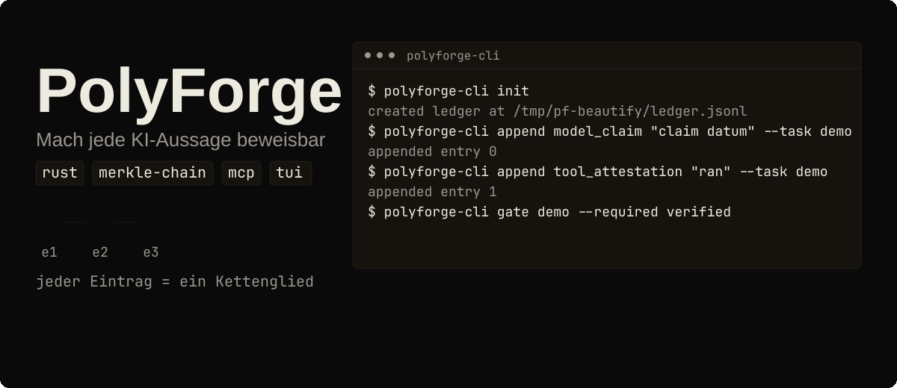
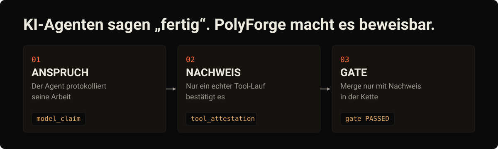

[English](README.md) | [Русский](README.ru.md) | **Deutsch** | [中文](README.zh-CN.md)

# PolyForge

[](LICENSE)
[](https://github.com/tensorov/polyforge/actions)
[](https://www.rust-lang.org)
[](https://crates.io/crates/polyforge-core)
[](https://crates.io/crates/polyforge-toolrunner)
[](https://crates.io/crates/polyforge-mcp)
[](https://crates.io/crates/polyforge-cli)
[](https://crates.io/crates/polyforge-tui)

<p align="center"></p>
<p align="center"><sub>Animierte Demo. Lieber ein statisches Bild? Öffne <a href="assets/readme/hero.de.svg">assets/readme/hero.de.svg</a>.</sub></p>

## KI-Agenten sagen „fertig“. PolyForge macht es beweisbar.

<p align="center"></p>

## Was ist PolyForge?

KI-Coding-Agents arbeiten schnell und berichten ihre eigenen Ergebnisse. PolyForge fügt deinem Repository ein Notizbuch hinzu, das die Geschichte nicht lautlos umschreiben kann. Der Agent notiert, was er getan zu haben behauptet. Ein echter Tool-Lauf, etwa Tests, Typprüfungen oder ein Build, muss jede Behauptung bestätigen, bevor sie als verifiziert zählt. Fehlt der Nachweis, bleibt das Gate rot und die Arbeit wird nicht gemergt.

Unter der Haube ist dieses Notizbuch eine append-only Merkle-Kette: Jeder Eintrag committet auf den Hash des vorherigen, sodass das Ändern eines einzigen Bytes die Kette bricht und jede spätere Prüfung fehlschlägt.

## Nachweis

Alles hier Beschriebene ist durch 303 Tests über die fünf Workspace-Crates abgedeckt, dazu CLI-/MCP-Smoke- und End-to-End-Harnesses. Führe die Suite selbst aus: `cargo build --workspace && cargo test --workspace`.

Drei weitere Gründe, den Zahlen zu vertrauen:

- Dieses Repository gated seine eigene CI mit [tensorov/polyforge-action@v1](https://github.com/tensorov/polyforge-action) bei jedem Push und Pull Request.
- Gate-Bundles sind reproduzierbar: Ein zweiter erfolgreicher Lauf erzeugt ein byte-identisches Bundle mit demselben SHA-256.
- Ein lauffähiger End-to-End-Durchlauf des Evidence-Lebenszyklus liegt in [crates/polyforge-core/examples/ledger_flow.rs](crates/polyforge-core/examples/ledger_flow.rs): `cargo run -p polyforge-core --example ledger_flow`.

## Installation & erster Lauf

Installiere von [crates.io](https://crates.io). Alle fünf Crates sind bei v0.3.0 veröffentlicht; `polyforge-tui` kommt mit diesem Release. Du brauchst eine Rust-Toolchain (1.85 oder neuer, 1.88+ für die TUI):

```sh
cargo install polyforge-cli polyforge-mcp polyforge-tui
```

Zeichne eine Behauptung auf, beweise sie mit einer Tool-Attestation, validiere sie und bestehe zwei Gates:

```sh
export PF_LEDGER=/tmp/pf-demo/ledger.jsonl
export PF_EVIDENCE_DIR=/tmp/pf-demo/evidence/
polyforge-cli init
polyforge-cli append model_claim "claim datum" --task demo --commit abc123 --diff d1
polyforge-cli append tool_attestation "ran" --task demo
polyforge-cli ledger tail
polyforge-cli gate demo --required verified
polyforge-cli append validation "operator check" --task demo
polyforge-cli gate demo --required validated
```

Was passiert ist: `init` hat die Ledger angelegt (Nachweiskette), der Model Claim erzeugte einen `ModelClaimed`-Eintrag, die Tool-Attestation beförderte ihn zu `Verified`, die Validation beförderte ihn weiter zu `Validated`, und beide Gates bestanden mit Exit-Code 0. `ledger tail` gab den 64-stelligen hexadezimalen SHA-256-Tail-Hash der Kette aus.


## Wie es funktioniert

Evidence ist dreizuständig und bewegt sich nur vorwärts:


- `model_claim`: Das Modell zeichnet eine Behauptung über seine eigene Arbeit auf. Erzeugt einen `ModelClaimed`-Eintrag.
- `tool_attestation`: Ein allowlisteter Tool-Lauf befördert die Behauptung des Tasks zu `Verified`.
- `eval_attestation`: Ein Operator zeichnet ein Evaluationsergebnis auf (Experiment, Run, Modell-Fingerprint, Budget), das eine Behauptung ebenfalls zu `Verified` befördert.
- `discrepancy`: Ein Operator oder der Toolrunner bei fehlgeschlagenem Verifier-Lauf zeichnet eine Widerlegungsspur auf, die die Behauptung zu `Refuted` bewegt.
- `validation`: Eine Operator-Validation befördert einen `Verified`-Eintrag zu `Validated`.

Ein Gate kann `verified`, `validated` oder beides verlangen. `Refuted`-Einträge werden aufgezeichnet, erfüllen aber nie ein Gate. Tool-Attestationen tragen einen Wall-Clock-Zeitstempel, und wenn ein Verifier innerhalb eines Git-Checkouts läuft, spiegelt die aufgezeichnete Payload den Repository-Zustand (Commit und Diff) wider statt eines nackten Befehlsstrings.

## Nie vertrauen, immer verifizieren

- Das Wort eines Modells allein genügt nie. `model_claim` kann nur einen neuen `ModelClaimed`-Eintrag erzeugen, nichts weiter.
- Um `Verified` zu erreichen, braucht es eine Attestation von einem allowlisteten Tool: `cargo`, `rustc` und `gcc` für Rust und C; `pytest`, `ruff`, `mypy` und `pyright` für Python; `vitest`, `tsc`, `eslint` und `biome` für JavaScript und TypeScript.
- Über MCP sitzt das Schloss fester: Das Tool `evidence_append` akzeptiert nur `kind=ModelClaim`. Attestations, Validations und Discrepancies werden am Server abgelehnt, sodass ein verbundenes Modell gar keine `Verified`-, `Refuted`- oder `Validated`-Einträge erzeugen kann.

## Gate in CI

Die veröffentlichte Action gated einen Task gegen die Ledger und verifiziert den committeten Merkle-Ketten-Anker. Dieses Repository führt sie bei jedem Push und Pull Request aus.

```yaml
- uses: tensorov/polyforge-action@v1
  with:
    task-id: my-task
    required: verified,validated
    ledger-path: .pf/ledger.jsonl
    evidence-dir: .pf/evidence/
```

| Input          | Erforderlich | Standard             | Beschreibung                                              |
| -------------- | ------------ | -------------------- | --------------------------------------------------------- |
| `task-id`      | ja           |                      | Task-ID, gegen die die Ledger gegated wird.               |
| `required`     | nein         | `verified,validated` | Kommagetrennte Liste der erforderlichen Evidence-Zustände. |
| `ledger-path`  | nein         | `.pf/ledger.jsonl`   | Ledger-Pfad relativ zum Workspace-Root.                   |
| `evidence-dir` | nein         | `.pf/evidence/`      | Evidence-Verzeichnis relativ zum Workspace-Root.          |

Die Action schlägt geschlossen fehl (fail-closed): Eine korrupte Kette, ein fehlender Anker oder ein Gate, das den erforderlichen Zustand nie erreicht, lässt den Job fehlschlagen. Füge den Job als Required Status Check in einem Branch-Ruleset hinzu, dann kann ein PR nicht mergen, solange das Gate rot ist.

Ein bestandenes Gate schreibt `gate-<task_id>.jsonl` plus `gate-<task_id>.manifest.json` mit `task_id`, `tail_hash`, `passed`, `bundle_sha256` und `tool_versions`. Ein fehlgeschlagenes Gate endet mit Nicht-Null-Exit-Code und schreibt kein Bundle. Standardmäßig wertet das Gate die neueste Behauptung des Tasks aus; übergib `--commit <sha> --diff <hash>`, um es auf eine bestimmte Behauptung zu pinnen, und ein gepinntes Gate, das nicht mehr zur neuesten Behauptung passt, wird als veraltet (stale) abgelehnt statt stillschweigend gegen ältere Evidence zu bestehen. Läuft ein fremdes Repo in CI: Füge vor der Action einen Rust-Toolchain-Schritt hinzu (zum Beispiel `dtolnay/rust-toolchain`), denn die Action führt `cargo install polyforge-cli --locked` aus.

## Verbinde deine Agents

Jeder Agent registriert denselben `polyforge-mcp`-Server über stdio. Stelle sicher, dass `polyforge-mcp` auf `PATH` liegt, oder richte `command` auf den vollen Pfad deines gebauten Binaries.

### OpenCode

In `opencode.json` (Projekt-Root oder `~/.config/opencode/`):

```json
{
  "mcp": {
    "polyforge": {
      "type": "local",
      "command": ["polyforge-mcp"],
      "env": {
        "PF_MCP_TRANSPORT": "stdio"
      }
    }
  }
}
```

### Claude Code

```sh
claude mcp add polyforge -- polyforge-mcp
```

### Codex

In `~/.codex/config.toml`:

```toml
[mcp_servers.polyforge]
command = "polyforge-mcp"
env = { PF_MCP_TRANSPORT = "stdio" }
```

### OpenClaw

In `~/.openclaw/config.json` (Beispiel, Pfad anpassen):

```json
{
  "mcpServers": {
    "polyforge": {
      "command": "polyforge-mcp",
      "args": [],
      "env": {
        "PF_MCP_TRANSPORT": "stdio"
      }
    }
  }
}
```

Der Server stellt vier Tools bereit: `evidence_append` (akzeptiert nur `ModelClaim`, damit Modelle niemals Attestations oder Validations anhängen können), `evidence_verify` (führt ein allowlistetes Tool aus, um eine Behauptung zu verifizieren; beliebige Binaries werden nie ausgeführt) sowie das Read-only-Paar `gate_evaluate` und `gate_report`.

Transportoptionen: `PF_MCP_TRANSPORT=stdio` (Standard) oder `tcp` mit `PF_MCP_ADDR` (Standard `127.0.0.1:18888`). Der TCP-Listener lauscht nur am Loopback und verlangt `PF_MCP_TOKEN`; jede Anfrage muss ihn als `_pf_token` mitführen, und ein fehlender oder ungültiger Token wird mit JSON-RPC-Fehler `-32001` abgelehnt. `PF_MCP_LEDGER` wählt den Ledger-Pfad (Standard `.pf/ledger.jsonl`).

## Operator-Konsole

LazyForge ist ein Terminal-UI zum Durchstöbern von Tasks, Validieren von Einträgen und Bulk-Validieren über die Evidence-Ledger. Installiere es mit `cargo install polyforge-tui` (Binary: `lazyforge`) und lies den [LazyForge-Benutzerleitfaden](docs/lazyforge.md). Verifizierte Integrationsleitfäden für OpenCode, Claude Code und Codex liegen in [docs/integrations/](docs/integrations/), und das Einreichungskit für das MCP-Servers-Verzeichnis liegt in [docs/mcp-servers-pr-kit/](docs/mcp-servers-pr-kit/).

<details>
<summary><b>Architektur: fünf Crates</b></summary>

Workspace aus fünf Crates (Edition 2021, rust-version 1.85, entwickelt gegen Toolchain 1.95.0):

| Crate                  | Verantwortlichkeit                                                                                                       |
| ---------------------- | ------------------------------------------------------------------------------------------------------------------------ |
| `polyforge-core`       | Evidence-Modell: dreizuständige Einträge, Promotionsregeln, die append-only Merkle-Ledger und deterministische Gate-Auswertung. |
| `polyforge-toolrunner` | Allowlisteter Toolrunner: nur allowlistete Binaries, typisierte Argumente, keine Shell, pro-Befehl-Umgebungs-Fingerprint.     |
| `polyforge-mcp`        | Model Context Protocol Server (rmcp): die Schnittstelle, über die Modelle Claims anhängen und Gates abfragen.                |
| `polyforge-cli`        | Operator-CLI: init, append, Ledger-Inspektion und Gate-Ausführung über eine lokale Ledger.                                   |
| `polyforge-tui`        | LazyForge Terminal-Operator-Konsole: Tasks durchstöbern, validieren, Bulk-Validieren über die Evidence-Ledger.               |

Das CLI-Binary heißt `polyforge-cli` (der Crate-Name); `alias pf=polyforge-cli`, falls du den Kurznamen bevorzugst.

Umgebungs-Fingerprints sind pro Befehl: Ein Nix-Store-Pfad-Digest und `devbox.lock` sha256 fließen ein, wenn vorhanden, `Cargo.lock` sha256 immer, dazu die Werte wichtiger Build-Umgebungsvariablen wie `CFLAGS`/`CXXFLAGS`/`LDFLAGS`/`RUSTDOCFLAGS`, wenn gesetzt. Für Python- und JS/TS-Repos faltet der Runner `uv.lock`, `pnpm-lock.yaml`, `package-lock.json` und `yarn.lock` ein, wenn vorhanden, gefunden vom Git-Root oder cwd-Vorfahren, sodass kein `Cargo.toml` nötig ist.

Mutierende oder Code-ladende Flags werden bei der Validation abgelehnt: `--fix` / `--unsafe-fixes` (ruff check), `--fix` / `--rulesdir` / `--resolve-plugins-relative-to` und Nicht-Builtin-`--format`-Werte (eslint), `--apply` / `--apply-unsafe` / `--write` (biome check), `-u` / `--update` (vitest run), `-p` (außer `-p no:*`) und `--pdb` (pytest). `gcc -v` akzeptiert keine zusätzlichen Argumente. Package-Runner (`uv run`, `npx`, `npm exec`) sind vollständig ausgeschlossen, weil ihr argv eine unbegrenzte Binary-Menge auflöst. Tools werden vom PATH des Polyforge-Prozesses aufgelöst; die Aktivierung des venv deines Projekts vor Attestations ist Aufgabe des Operators.

Weitere CLI-Oberfläche: `ledger summary` gibt die Zustandszahlen pro Task als eine grep-bare Zeile aus (`tasks_verified=… tasks_validated=… tasks_failed=…`); `coverage-check --report <llvm-cov.json>` bewertet einen `cargo llvm-cov --json`-Report gegen die Coverage-Untergrenze (Standard 80% aggregiert / 80% pro Datei); jeder `append`-Kind akzeptiert optionale Record-only-Identity-Flags `--experiment`, `--model`, `--run`, `--budget` und `--metadata`, die durch die Promotion mitgeführt werden. Umgebungsvariablen: `PF_LEDGER` (Ledger-Pfad, Standard `.pf/ledger.jsonl`), `PF_EVIDENCE_DIR` (Gate-Bundles, Standard `.pf/evidence/`), `PF_ENV_FINGERPRINT` (vom Operator gelieferter Fingerprint, auf Attestations aufgezeichnet, Standard `cli`).

Aus dem Quellcode bauen:

```sh
cargo build --release   # binary lands in target/release/polyforge-cli
cargo build --workspace && cargo test --workspace
```

</details>

<details>
<summary><b>Tamper- und Rewind-Garantie</b></summary>

Die Ledger ist eine append-only Merkle-Kette: Jeder Eintrag committet auf den Hash des vorherigen Eintrags. Die Datei zurückzuspulen oder **ein Byte** eines Eintrags zu manipulieren bricht die Kette, und jedes nachfolgende `polyforge-cli gate` oder `evidence_verify` schlägt mit `LedgerIntegrity` fehl. Fehlgeschlagene Integritätsprüfungen fabrizieren nie ein Bundle oder Manifest: Der Fehler wird sichtbar gemacht und nichts wird geschrieben. Das Harness übt dies End-to-End aus (Byte-Flip im Tail-Eintrag bedeutet: das Gate endet mit Nicht-Null-Exit-Code samt `ledger integrity broken at seq …`, kein Bundle, kein Manifest).

Die Kette ist gegen Umsortierung und gleichzeitige Schreiber gehärtet: Einträge nutzen eine length-prefixed kanonische Kodierung (Hash-Version 2), und ein committeter Anker-Sidecar hält das Kettenende fest, sodass ein Rewind über den Anker hinaus erkannt wird. Schreiber nehmen eine exklusive Dateisperre (`fs2`) um jeden Append, sodass gleichzeitige Prozesse keine Einträge verschränken können.

Geltungsbereich: Tamper-Evidenz gilt innerhalb eines vertrauenswürdigen Checkouts. Die Kette beweist, dass die Ledger nicht umgeschrieben wurde, nicht dass der Checkout selbst authentisch ist. Kryptografisches externes Anchoring steht auf der Roadmap (Phase 3).

</details>

<details>
<summary><b>Vergleichsmatrix (Erhebung vom 2026-08-09)</b></summary>

PolyForge ist eine Evidence-Ledger in einem einzigen Format: eine append-only Merkle-Kette, ein dreizuständiges Eintragsmodell, ein deterministisches Gate. Die folgende Matrix erfasst die direkten Evidence-Ledger- und MCP-Tools, gefunden am 2026-08-09, plus drei benachbarte Kategorien zur Einordnung. Unter den erfassten direkten Evidence-Ledger-Tools ist PolyForge der einzige beobachtete Rust-Crate-Workspace; die übrigen sind einsprachig oder proprietär. Fakten stammen von der öffentlichen Seite jedes Projekts; wo eine Quelle schweigt, liest sich die Zelle als `?`.

| Feature | PolyForge | agent-gate | AttestMCP | AGA MCP | audit-ledger-mcp | Xiid | Zyvra | Omega | Observability | Provenance | Sandboxes |
| ------- | --------- | ---------- | --------- | ------- | ---------------- | ---- | ----- | ------ | ------------- | ---------- | --------- |
| Tamper-evidente Ledger | ✅ | ✅ | ✅ | ✅ | ✅ | ? | ? | ? | ? | ? | ? |
| Deterministisches Gate | ✅ | ✅ | ? | ✅ | ? | ? | ? | ? | ? | ? | ? |
| MCP-Schnittstelle | ✅ | ? | ✅ | ✅ | ✅ | ? | ? | ? | ? | ? | ? |
| CLI | ✅ | ? | ? | ? | ? | ? | ? | ? | ? | ? | ? |
| Open Source | ✅ | ✅ | ✅ | ✅ | ✅ | ❌ | ? | ? | ? | ? | ? |
| Rust | ✅ | ❌ | ❌ | ❌ | ? | ? | ? | ? | ? | ? | ? |
| Dreizuständiges Evidence-Modell | ✅ | ? | ? | ? | ? | ? | ? | ? | ? | ? | ? |
| Fail-closed bei Integritätsbruch | ✅ | ✅ | ? | ? | ? | ? | ? | ? | ? | ? | ? |
| Evidence-Bundle-Ausgabe | ✅ | ? | ? | ? | ? | ? | ? | ? | ? | ? | ? |
| Hardware-Attestation | ❌ | ? | ? | ? | ? | ? | ? | ✅ | ? | ? | ? |
| SaaS / gehostet | ❌ | ? | ? | ? | ? | ? | ✅ | ? | ? | ? | ? |

Legende: ✅ = Feature durch die zitierte Quelle bestätigt · ❌ = Quelle gibt explizit an, dass das Feature fehlt · `?` = Quelle schweigt (unbekannt).

Quellen (abgerufen am 2026-08-09):

1. `agent-gate` — Jott2121/agent-gate — https://github.com/Jott2121/agent-gate
2. `AttestMCP` — attestmcp/attestmcp — https://github.com/attestmcp/attestmcp
3. `AGA MCP` — attestedintelligence/aga-mcp-server — https://github.com/attestedintelligence/aga-mcp-server
4. `audit-ledger-mcp` — shahidh68/audit-ledger-mcp — https://github.com/shahidh68/audit-ledger-mcp
5. `Xiid` — https://xiid.com
6. `Zyvra` — https://zyvra.tech
7. `Omega` — arXiv 2512.05951 — https://arxiv.org/abs/2512.05951
8. `Observability` — LangSmith / Langfuse / AgentOps / Arize Phoenix / Helicone — https://docs.smith.langchain.com, https://helicone.ai
9. `Provenance` — in-toto / Sigstore/cosign / Witness / SLSA — https://in-toto.io
10. `Sandboxes` — e2b / Modal / Daytona — https://e2b.dev

Insgesamt betrachtet: Unter den am 2026-08-09 erfassten direkten Evidence-Ledger-Tools ist PolyForge der einzige Rust-Crate-Workspace, der eine Merkle-Ledger in einem Format, ein deterministisches Gate und eine MCP-Schnittstelle in einem Workspace vereint.

</details>

<details>
<summary><b>Performance</b></summary>

Gemessen auf der Entwicklungsmaschine mit dem Release-Binary und einer frischen Ledger in `/tmp/pf-bench`; das neu gebaute Binary ist byte-identisch mit dem gemessenen:

| Szenario | Wert | So reproduzierst du es |
| -------- | ----- | ---------------- |
| Vollständige Kette über 100 Tasks (300 Ledger-Appends) | 0.510 s | `time ( for i in $(seq 1 100); do polyforge-cli append model_claim "bench claim $i" --task task$i --commit c$i --diff d$i >/dev/null; polyforge-cli append tool_attestation "ran" --task task$i >/dev/null; polyforge-cli append validation "op" --task task$i >/dev/null; done )` |
| 100 Gate-Prüfungen über eine 300-Einträge-Ledger | 0.500 s | `time ( for i in $(seq 1 100); do polyforge-cli gate task$i --required validated >/dev/null; done )` |
| Release-Binary-Größe | 774664 B | `stat -c%s target/release/polyforge-cli` |
| Voller Clean-Rebuild (`cargo clean` + `cargo build --release`) | 34.15 s | `cargo clean && time cargo build --release` |

</details>

<details>
<summary><b>Roadmap</b></summary>

Pfad zur Produktionsreife, alle Details in [docs/ROADMAP.md](docs/ROADMAP.md). Die Prioritäten folgen zwei Zwängen: Attestations müssen unmanipulierbar und reproduzierbar sein (Vertrauen zuerst), und PolyForge gated seine eigene Entwicklung (Dogfooding).

| Phase | Status | Kernpunkte |
| ----- | ------ | --------- |
| Phase 0: Trust Hardening + Self-Gating | **Ausgeliefert** | Mutation Testing (`cargo-mutants`, Stryker), Nix/Devbox-Fingerprints, `polyforge-action` Self-Gating auf diesem Repo |
| Phase 1: Adoption | **Ausgeliefert** | [`tensorov/polyforge-action`](https://github.com/tensorov/polyforge-action) v1 veröffentlicht, Python/TS-Toolrunner, LazyForge TUI. Cline/Aider/Cursor-Prompts bewusst gestrichen. |
| Phase 2: Skalierung & Observability | **Gestartet** | OpenTelemetry/OTLP-Exporter-Subcommand existiert. Als Nächstes: Remote-Backend (PostgreSQL + S3/DynamoDB), Web-Dashboard + REST/gRPC-API, LangGraph/CrewAI/AutoGen-Middleware |
| Phase 3: Enterprise & Ökosystem | Zukunft | SLSA/in-toto/Sigstore, tiefe Plugins (Cursor/Windsurf/Continue.dev), Web-Human-in-the-Loop, Policy-as-Code |
| Moonshot-Backlog | Zukunft | Verification-Marketplace, TEE-/Hardware-Attestationen |

</details>

## Lizenz

PolyForge steht unter der [Apache License, Version 2.0](LICENSE). Siehe die Datei [NOTICE](NOTICE) für Anforderungen an die Namensnennung.

## Mitwirken

Bevor du ein Issue eröffnest, lies bitte [SECURITY.md](SECURITY.md), wie du Schwachstellen meldest. Feature- und Bug-Reports nutzen die Vorlagen unter [.github/ISSUE_TEMPLATE/](.github/ISSUE_TEMPLATE/).
