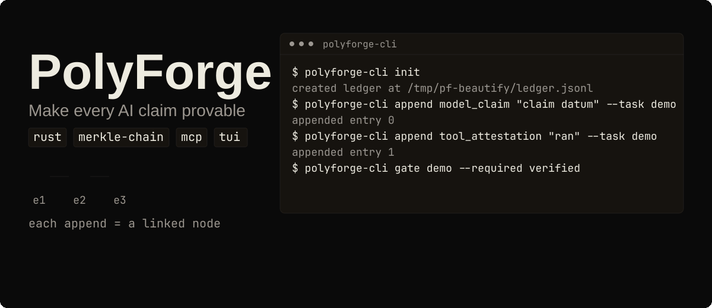
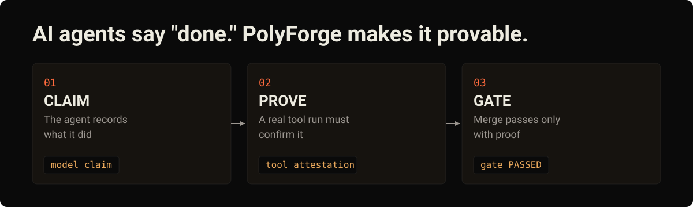

**English** | [Русский](README.ru.md) | [Deutsch](README.de.md) | [中文](README.zh-CN.md)

# PolyForge

[](LICENSE)
[](https://github.com/tensorov/polyforge/actions)
[](https://www.rust-lang.org)
[](https://crates.io/crates/polyforge-core)
[](https://crates.io/crates/polyforge-toolrunner)
[](https://crates.io/crates/polyforge-mcp)
[](https://crates.io/crates/polyforge-cli)
[](https://crates.io/crates/polyforge-tui)

<p align="center"></p>
<p align="center"><sub>Animated demo. Prefer a static image? Open <a href="assets/readme/hero.en.svg">assets/readme/hero.en.svg</a>.</sub></p>

## AI agents say "done." PolyForge makes it provable.

<p align="center"></p>

## What is PolyForge?

AI coding agents work fast and report their own results. PolyForge adds a notebook to your repository that cannot quietly rewrite history. The agent writes down what it claims to have done. A real tool run, such as tests, type checks, or a build, must confirm each claim before it counts as verified. When the proof is missing, the gate stays red and the work does not merge.

Under the hood that notebook is an append-only Merkle chain: every entry commits to the hash of the previous one, so editing a single byte breaks the chain and every later check fails.

## Proof

Everything described here is covered by 303 tests across the five workspace crates, plus CLI/MCP smoke and end-to-end harnesses. Run the suite yourself: `cargo build --workspace && cargo test --workspace`.

Three more reasons to trust the numbers:

- This repository gates its own CI with [tensorov/polyforge-action@v1](https://github.com/tensorov/polyforge-action) on every push and pull request.
- Gate bundles are reproducible: a second passing run produces a byte-identical bundle and the same SHA-256.
- A runnable end-to-end walkthrough of the evidence lifecycle ships in [crates/polyforge-core/examples/ledger_flow.rs](crates/polyforge-core/examples/ledger_flow.rs): `cargo run -p polyforge-core --example ledger_flow`.

## Install & first run

Install from [crates.io](https://crates.io). All five crates are published at v0.3.0; `polyforge-tui` ships with this release. You need a Rust toolchain (1.85 or newer, 1.88+ for the TUI):

```sh
cargo install polyforge-cli polyforge-mcp polyforge-tui
```

Record a claim, prove it with a tool attestation, validate it, and pass two gates:

```sh
export PF_LEDGER=/tmp/pf-demo/ledger.jsonl
export PF_EVIDENCE_DIR=/tmp/pf-demo/evidence/
polyforge-cli init
polyforge-cli append model_claim "claim datum" --task demo --commit abc123 --diff d1
polyforge-cli append tool_attestation "ran" --task demo
polyforge-cli ledger tail
polyforge-cli gate demo --required verified
polyforge-cli append validation "operator check" --task demo
polyforge-cli gate demo --required validated
```

What happened: `init` created the ledger, the model claim created a `ModelClaimed` entry, the tool attestation promoted it to `Verified`, the validation promoted it further to `Validated`, and both gates passed with exit code 0. `ledger tail` printed the 64-hex SHA-256 tail hash of the chain.


## How it works

Evidence is tri-state and only ever moves forward:


- `model_claim`: the model records a claim about its own work. Creates a `ModelClaimed` entry.
- `tool_attestation`: an allowlisted tool run promotes the task's claim to `Verified`.
- `eval_attestation`: an operator records an evaluation outcome (experiment, run, model fingerprint, budget) that also promotes a claim to `Verified`.
- `discrepancy`: an operator, or the toolrunner on a failed verifier run, records a refutation trace that moves the claim to `Refuted`.
- `validation`: an operator validation promotes a `Verified` entry to `Validated`.

A gate can require `verified`, `validated`, or both. `Refuted` entries are recorded but never satisfy a gate. Tool attestations carry a wall-clock timestamp, and when a verifier runs inside a git checkout the recorded payload reflects the repository state (commit and diff) rather than a bare command string.

## Never trust, always verify

- A model's word alone is never enough. `model_claim` can only create a new `ModelClaimed` entry, nothing more.
- Reaching `Verified` requires an attestation from an allowlisted tool: `cargo`, `rustc`, and `gcc` for Rust and C; `pytest`, `ruff`, `mypy`, and `pyright` for Python; `vitest`, `tsc`, `eslint`, and `biome` for JavaScript and TypeScript.
- Over MCP the lock is tighter: the `evidence_append` tool accepts `kind=ModelClaim` only. Attestations, validations, and discrepancies are rejected at the server, so a connected model cannot create `Verified`, `Refuted`, or `Validated` entries at all.

## Gate it in CI

The published action gates a task against the ledger and verifies the committed Merkle-chain anchor. This repository runs it on every push and pull request.

```yaml
- uses: tensorov/polyforge-action@v1
  with:
    task-id: my-task
    required: verified,validated
    ledger-path: .pf/ledger.jsonl
    evidence-dir: .pf/evidence/
```

| Input          | Required | Default              | Description                                         |
| -------------- | -------- | -------------------- | --------------------------------------------------- |
| `task-id`      | yes      |                      | Task id to gate against the ledger.                 |
| `required`     | no       | `verified,validated` | Comma-list of required evidence states.             |
| `ledger-path`  | no       | `.pf/ledger.jsonl`   | Ledger path relative to the workspace root.         |
| `evidence-dir` | no       | `.pf/evidence/`      | Evidence directory relative to the workspace root.  |

The action fails closed: a corrupted chain, a missing anchor, or a gate that never reaches the required state fails the job. Add the job as a required status check in a branch ruleset and a PR cannot merge while the gate is red.

A passing gate writes `gate-<task_id>.jsonl` plus `gate-<task_id>.manifest.json` containing `task_id`, `tail_hash`, `passed`, `bundle_sha256`, and `tool_versions`. A failing gate exits non-zero and writes no bundle. By default the gate evaluates the task's latest claim; pass `--commit <sha> --diff <hash>` to pin it to a specific claim, and a pinned gate that no longer matches the latest claim is rejected as stale instead of silently passing against older evidence. Running a foreign repo in CI: add a Rust toolchain step (for example `dtolnay/rust-toolchain`) before the action, which runs `cargo install polyforge-cli --locked`.

## Connect your agents

Every agent registers the same `polyforge-mcp` server over stdio. Make sure `polyforge-mcp` is on `PATH`, or point `command` at the full path to your built binary.

### OpenCode

In `opencode.json` (project root or `~/.config/opencode/`):

```json
{
  "mcp": {
    "polyforge": {
      "type": "local",
      "command": ["polyforge-mcp"],
      "env": {
        "PF_MCP_TRANSPORT": "stdio"
      }
    }
  }
}
```

### Claude Code

```sh
claude mcp add polyforge -- polyforge-mcp
```

### Codex

In `~/.codex/config.toml`:

```toml
[mcp_servers.polyforge]
command = "polyforge-mcp"
env = { PF_MCP_TRANSPORT = "stdio" }
```

### OpenClaw

In `~/.openclaw/config.json` (example, adjust path):

```json
{
  "mcpServers": {
    "polyforge": {
      "command": "polyforge-mcp",
      "args": [],
      "env": {
        "PF_MCP_TRANSPORT": "stdio"
      }
    }
  }
}
```

The server exposes four tools: `evidence_append` (accepts `ModelClaim` only, so models can never append attestations or validations), `evidence_verify` (runs an allowlisted tool to verify a claim; arbitrary binaries are never executed), and the read-only pair `gate_evaluate` and `gate_report`.

Transport options: `PF_MCP_TRANSPORT=stdio` (default) or `tcp` with `PF_MCP_ADDR` (default `127.0.0.1:18888`). The TCP listener is loopback-only and requires `PF_MCP_TOKEN`; every request must carry it as `_pf_token`, and a missing or invalid token is rejected with JSON-RPC error `-32001`. `PF_MCP_LEDGER` selects the ledger path (default `.pf/ledger.jsonl`).

## Operator console

LazyForge is a terminal UI for browsing tasks, validating entries, and bulk-validating over the evidence ledger. Install it with `cargo install polyforge-tui` (binary: `lazyforge`) and read the [LazyForge user guide](docs/lazyforge.md). Verified integration guides for OpenCode, Claude Code, and Codex live in [docs/integrations/](docs/integrations/), and the MCP servers-directory submission kit is in [docs/mcp-servers-pr-kit/](docs/mcp-servers-pr-kit/).

<details>
<summary><b>Architecture: five crates</b></summary>

Workspace of five crates (edition 2021, rust-version 1.85, developed against toolchain 1.95.0):

| Crate                  | Responsibility                                                                                                        |
| ---------------------- | ---------------------------------------------------------------------------------------------------------------------- |
| `polyforge-core`       | Evidence model: tri-state entries, promotion rules, the append-only Merkle ledger, and deterministic gate evaluation.    |
| `polyforge-toolrunner` | Allowlisted tool runner: only allowlisted binaries, typed arguments, no shell, per-command environment fingerprint.       |
| `polyforge-mcp`        | Model Context Protocol server (rmcp): the interface models use to append claims and query gates.                         |
| `polyforge-cli`        | Operator CLI: init, append, ledger inspection, and gate execution over a local ledger.                                   |
| `polyforge-tui`        | LazyForge terminal operator console: browse tasks, validate, bulk-validate over the evidence ledger.                      |

The CLI binary is named `polyforge-cli` (the crate name); `alias pf=polyforge-cli` if you prefer the short name.

Environment fingerprints are per-command: a Nix store-path digest and `devbox.lock` sha256 are folded in when present, `Cargo.lock` sha256 always, plus the values of key build env vars such as `CFLAGS`/`CXXFLAGS`/`LDFLAGS`/`RUSTDOCFLAGS` when set. For Python and JS/TS repos the runner folds `uv.lock`, `pnpm-lock.yaml`, `package-lock.json`, and `yarn.lock` when present, discovered from the git root or cwd ancestors, so no `Cargo.toml` is required.

Mutating or code-loading flags are denied at validation: `--fix` / `--unsafe-fixes` (ruff check), `--fix` / `--rulesdir` / `--resolve-plugins-relative-to` and non-builtin `--format` values (eslint), `--apply` / `--apply-unsafe` / `--write` (biome check), `-u` / `--update` (vitest run), `-p` (except `-p no:*`) and `--pdb` (pytest). `gcc -v` accepts no extra args. Package runners (`uv run`, `npx`, `npm exec`) are excluded entirely because their argv resolves an unbounded binary set. Tools resolve from the PATH of the polyforge process; activating your project's venv before running attestations is operator duty.

Other CLI surface: `ledger summary` prints per-task state counts as one grep-able line (`tasks_verified=… tasks_validated=… tasks_failed=…`); `coverage-check --report <llvm-cov.json>` evaluates a `cargo llvm-cov --json` report against the coverage floor (default 80% aggregate / 80% per file); any `append` kind accepts optional record-only identity flags `--experiment`, `--model`, `--run`, `--budget`, and `--metadata`, carried through promotion. Environment variables: `PF_LEDGER` (ledger path, default `.pf/ledger.jsonl`), `PF_EVIDENCE_DIR` (gate bundles, default `.pf/evidence/`), `PF_ENV_FINGERPRINT` (operator-supplied fingerprint recorded on attestations, default `cli`).

Build from source:

```sh
cargo build --release   # binary lands in target/release/polyforge-cli
cargo build --workspace && cargo test --workspace
```

</details>

<details>
<summary><b>Tamper and rewind guarantee</b></summary>

The ledger is an append-only Merkle chain: every entry commits to the hash of the previous entry. Rewinding the file or tampering with **one byte** of any entry breaks the chain, and any subsequent `polyforge-cli gate` or `evidence_verify` fails with `LedgerIntegrity`. Failed integrity checks never fabricate a bundle or manifest: the failure is surfaced and nothing is written. This is exercised end-to-end by the harness (byte-flip in the tail entry means the gate exits non-zero with `ledger integrity broken at seq …`, no bundle, no manifest).

The chain is hardened against reordering and concurrent writers: entries use a length-prefixed canonical encoding (hash version 2), and a committed anchor sidecar records the chain tail so a rewind past the anchor is detected. Writers take an exclusive file lock (`fs2`) around each append, so concurrent processes cannot interleave entries.

Scope note: tamper evidence holds within a trusted checkout. The chain proves the ledger was not rewritten, not that the checkout itself is authentic. Cryptographic external anchoring is on the roadmap (Phase 3).

</details>

<details>
<summary><b>Comparison matrix (survey dated 2026-08-09)</b></summary>

PolyForge is a single-format evidence ledger: one append-only Merkle chain, one tri-state entry model, one deterministic gate. The matrix below surveys the direct evidence-ledger and MCP tools found on 2026-08-09, plus three adjacent categories for context. Among the direct evidence-ledger tools surveyed, PolyForge is the only Rust crate-workspace observed; the rest are single-language or proprietary. Facts come from each project's public page; where a source is silent the cell reads `?`.

| Feature | PolyForge | agent-gate | AttestMCP | AGA MCP | audit-ledger-mcp | Xiid | Zyvra | Omega | Observability | Provenance | Sandboxes |
| ------- | --------- | ---------- | --------- | ------- | ---------------- | ---- | ----- | ------ | ------------- | ---------- | --------- |
| Tamper-evident ledger | ✅ | ✅ | ✅ | ✅ | ✅ | ? | ? | ? | ? | ? | ? |
| Deterministic gate | ✅ | ✅ | ? | ✅ | ? | ? | ? | ? | ? | ? | ? |
| MCP interface | ✅ | ? | ✅ | ✅ | ✅ | ? | ? | ? | ? | ? | ? |
| CLI | ✅ | ? | ? | ? | ? | ? | ? | ? | ? | ? | ? |
| Open source | ✅ | ✅ | ✅ | ✅ | ✅ | ❌ | ? | ? | ? | ? | ? |
| Rust | ✅ | ❌ | ❌ | ❌ | ? | ? | ? | ? | ? | ? | ? |
| Tri-state evidence model | ✅ | ? | ? | ? | ? | ? | ? | ? | ? | ? | ? |
| Fail-closed on integrity break | ✅ | ✅ | ? | ? | ? | ? | ? | ? | ? | ? | ? |
| Evidence bundle output | ✅ | ? | ? | ? | ? | ? | ? | ? | ? | ? | ? |
| Hardware attestation | ❌ | ? | ? | ? | ? | ? | ? | ✅ | ? | ? | ? |
| SaaS / hosted | ❌ | ? | ? | ? | ? | ? | ✅ | ? | ? | ? | ? |

Legend: ✅ = feature confirmed by the cited source · ❌ = source explicitly states the feature is absent · `?` = source is silent (unknown).

Sources (accessed 2026-08-09):

1. `agent-gate` — Jott2121/agent-gate — https://github.com/Jott2121/agent-gate
2. `AttestMCP` — attestmcp/attestmcp — https://github.com/attestmcp/attestmcp
3. `AGA MCP` — attestedintelligence/aga-mcp-server — https://github.com/attestedintelligence/aga-mcp-server
4. `audit-ledger-mcp` — shahidh68/audit-ledger-mcp — https://github.com/shahidh68/audit-ledger-mcp
5. `Xiid` — https://xiid.com
6. `Zyvra` — https://zyvra.tech
7. `Omega` — arXiv 2512.05951 — https://arxiv.org/abs/2512.05951
8. `Observability` — LangSmith / Langfuse / AgentOps / Arize Phoenix / Helicone — https://docs.smith.langchain.com, https://helicone.ai
9. `Provenance` — in-toto / Sigstore/cosign / Witness / SLSA — https://in-toto.io
10. `Sandboxes` — e2b / Modal / Daytona — https://e2b.dev

Taken together: among the direct evidence-ledger tools surveyed on 2026-08-09, PolyForge is the only Rust crate-workspace combining a single-format Merkle ledger, a deterministic gate, and an MCP interface in one workspace.

</details>

<details>
<summary><b>Performance</b></summary>

Measured on the development machine with the release binary and a fresh ledger in `/tmp/pf-bench`; the rebuilt binary is byte-identical to the one measured:

| Scenario | Value | How to reproduce |
| -------- | ----- | ---------------- |
| 100-task full chain (300 ledger appends) | 0.510 s | `time ( for i in $(seq 1 100); do polyforge-cli append model_claim "bench claim $i" --task task$i --commit c$i --diff d$i >/dev/null; polyforge-cli append tool_attestation "ran" --task task$i >/dev/null; polyforge-cli append validation "op" --task task$i >/dev/null; done )` |
| 100 gate checks over a 300-entry ledger | 0.500 s | `time ( for i in $(seq 1 100); do polyforge-cli gate task$i --required validated >/dev/null; done )` |
| Release binary size | 774664 B | `stat -c%s target/release/polyforge-cli` |
| Full clean rebuild (`cargo clean` + `cargo build --release`) | 34.15 s | `cargo clean && time cargo build --release` |

</details>

<details>
<summary><b>Roadmap</b></summary>

Production-readiness path, full detail in [docs/ROADMAP.md](docs/ROADMAP.md). Priorities follow two constraints: attestations must be ungameable and reproducible (trust first), and PolyForge gates its own development (dogfooding).

| Phase | Status | Key items |
| ----- | ------ | --------- |
| Phase 0: Trust hardening + self-gating | **Shipped** | Mutation testing (`cargo-mutants`, Stryker), Nix/Devbox fingerprints, `polyforge-action` self-gating on this repo |
| Phase 1: Adoption | **Shipped** | [`tensorov/polyforge-action`](https://github.com/tensorov/polyforge-action) v1 published, Python/TS toolrunner, LazyForge TUI. Cline/Aider/Cursor prompts intentionally cut. |
| Phase 2: Scale & observability | **Started** | OpenTelemetry/OTLP exporter subcommand exists. Next: remote backend (PostgreSQL + S3/DynamoDB), web dashboard + REST/gRPC API, LangGraph/CrewAI/AutoGen middleware |
| Phase 3: Enterprise & ecosystem | Future | SLSA/in-toto/Sigstore, deep plugins (Cursor/Windsurf/Continue.dev), web human-in-the-loop, Policy-as-Code |
| Moonshot backlog | Future | Verification marketplace, TEE / hardware attestations |

</details>

## License

PolyForge is licensed under the [Apache License, Version 2.0](LICENSE). See the [NOTICE](NOTICE) file for attribution requirements.

## Contributing

Before opening an issue, please read [SECURITY.md](SECURITY.md) for how to report vulnerabilities. Feature and bug reports use the templates under [.github/ISSUE_TEMPLATE/](.github/ISSUE_TEMPLATE/).
