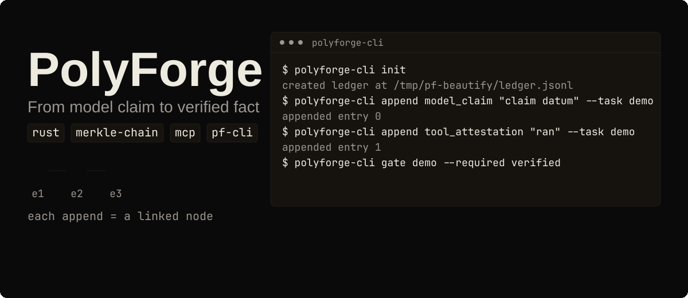
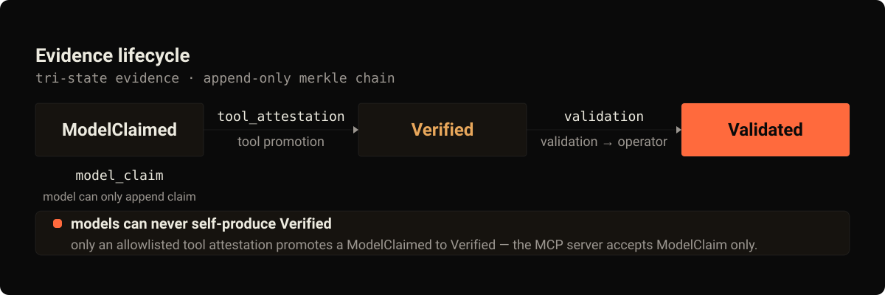
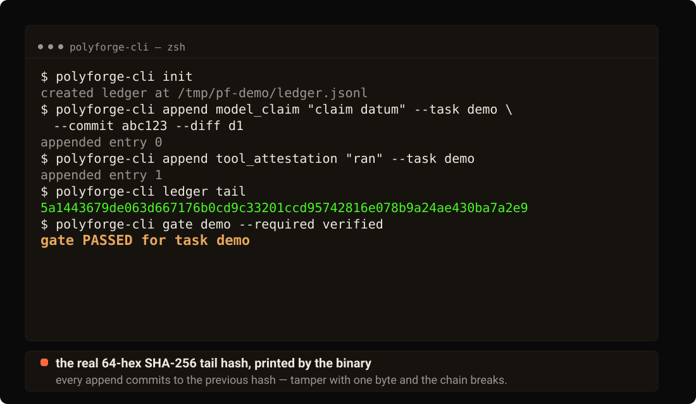

# PolyForge

[](LICENSE)
[](https://github.com/tensorov/polyforge/actions)
[](https://www.rust-lang.org)
[](https://crates.io/crates/polyforge-core)
[](https://crates.io/crates/polyforge-toolrunner)
[](https://crates.io/crates/polyforge-mcp)
[](https://crates.io/crates/polyforge-cli)

## Demo

[](assets/readme/hero.svg)

PolyForge is a tamper-evident evidence ledger for AI-driven engineering workflows: models
record claims, allowlisted tools attest them, and operators gate on the resulting chain.

## Proof

Everything in this README is covered by the workspace test suite (66 tests across the four
crates) and by the CLI/MCP smoke and end-to-end harnesses.

Run it yourself: `cargo build --workspace && cargo test --workspace` (see [Build from source](#build-from-source)).

## Why "PolyForge"

> **Why "PolyForge"**: *poly* — many agents working together; *forge* — the place where their raw claims are forged into verifiable evidence: through the gate, a model's claim becomes a fact only when a real tool run proves it. (And yes — the name is also a wink: this is the forge that makes forged history impossible.)

## Architecture

Workspace of four crates (edition 2021, rust-version 1.85, Rust toolchain 1.95.0):

| Crate                   | Crates.io                                                                                        | Responsibility                                                                                   |
| ----------------------- | ------------------------------------------------------------------------------------------------ | ------------------------------------------------------------------------------------------------ |
| `polyforge-core`        | [](https://crates.io/crates/polyforge-core) | Evidence model: tri-state entries, promotion rules, the append-only Merkle ledger, and deterministic gate evaluation. |
| `polyforge-toolrunner`  | [](https://crates.io/crates/polyforge-toolrunner) | Allowlisted tool runner: only allowlisted binaries (cargo/rustc/gcc), typed arguments, no shell, per-command environment fingerprint (Nix store-path digest + devbox.lock sha256 folded in when present, Cargo.lock sha256 always). |
| `polyforge-mcp`         | [](https://crates.io/crates/polyforge-mcp) | Model Context Protocol server (rmcp): the interface models use to append claims and query gates. |
| `polyforge-cli`         | [](https://crates.io/crates/polyforge-cli) | Operator CLI: init, append, ledger inspection, and gate execution over a local ledger.           |

All four crates are published to [crates.io](https://crates.io): `v0.1.0` of
`polyforge-core`, `polyforge-toolrunner`, `polyforge-mcp`, and `polyforge-cli` (install the
binaries with `cargo install polyforge-cli polyforge-mcp`).

The CLI binary is named `polyforge-cli` (the crate name). All examples in this README use
it directly; `alias pf=polyforge-cli` if you prefer the short name.

## Evidence lifecycle

Evidence is tri-state and only ever moves forward:



- `model_claim` — the model records a claim about its own work. Creates a `ModelClaimed` entry.
- `tool_attestation` — an allowlisted tool run produces a `ToolAttestation` entry that
  promotes the task's `ModelClaimed` entry to `Verified`.
- `eval_attestation` — an operator records an evaluation outcome (experiment, run, model
  fingerprint, budget) that promotes the task's `ModelClaimed` entry to `Verified`.
- `discrepancy` — an operator (or the toolrunner, on a failed verifier run) records a
  refutation trace that promotes the task's `ModelClaimed` entry to `Refuted`.
- `validation` — an operator validation produces a `Validation` entry that promotes the
  task's `Verified` entry to `Validated`.

A gate can require `verified` or `validated` (see below). `Refuted` entries are recorded
but never satisfy a gate in this milestone.

## Models can never self-produce `Verified`

- The CLI accepts five kinds: `model_claim`, `tool_attestation`, `validation`,
  `eval_attestation`, and `discrepancy`. `model_claim` can only create a new
  `ModelClaimed` entry.
- `tool_attestation` does not append a bare entry: it locates the task's latest
  `ModelClaimed` entry and promotes it. With no prior claim the append is rejected
  (models cannot self-promote).
- The MCP `evidence_append` tool accepts `kind=ModelClaim` **only**; `ToolAttestation`,
  `Validation`, `EvalAttestation`, and `Discrepancy` are rejected at the server — models
  connected over MCP cannot create `Verified`, `Refuted`, or `Validated` entries at all.
- Promotion is enforced by the single `promote` gatekeeper in `polyforge-core`; a model's
  only path toward `Verified` is an allowlisted tool attestation.

## Build from source

The workspace requires a Rust toolchain of at least version 1.85 (edition 2021; developed
against toolchain 1.95.0). Building the workspace in release mode produces the
`polyforge-cli` binary:

```sh
cargo build --release
```

The binary lands in `target/release/polyforge-cli`. Build and test the whole workspace:

```sh
cargo build --workspace
cargo test --workspace
```

## Quick start



The sequence below was run verbatim against the real binary, every command exiting 0:

```sh
export PF_LEDGER=/tmp/pf-demo/ledger.jsonl
export PF_EVIDENCE_DIR=/tmp/pf-demo/evidence/
polyforge-cli init
polyforge-cli append model_claim "claim datum" --task demo --commit abc123 --diff d1
polyforge-cli append tool_attestation "ran" --task demo
polyforge-cli ledger tail
polyforge-cli gate demo --required verified
polyforge-cli append validation "operator check" --task demo
polyforge-cli gate demo --required validated
```

What each step does:

- `init` creates the ledger and prints `created ledger at <path>`.
- `append model_claim ...` records a claim by the model; `append tool_attestation ...`
  promotes the task's claim to `Verified`; `append validation ...` promotes it further to
  `Validated`. Each `append` prints `appended entry N`.
- `ledger tail` prints the 64-hex SHA-256 tail hash of the Merkle chain.
- `gate demo --required verified` writes `gate-demo.jsonl` plus `gate-demo.manifest.json`
  and prints `gate PASSED for task demo`, exiting 0.
- On gate failure (required state not reached) the gate exits non-zero and writes no
  bundle.

The `--required` flag takes a comma-list such as `verified,validated`.

Environment variables:

- `PF_LEDGER` — ledger path (default `.pf/ledger.jsonl`).
- `PF_EVIDENCE_DIR` — directory for gate bundles and manifests (default `.pf/evidence/`).

## CI integration / GitHub Actions

The published action [`tensorov/polyforge-action`](https://github.com/tensorov/polyforge-action)
gates a task in CI and verifies the committed Merkle-chain anchor. This repository dogfoods
it on every push and pull request (see `.github/workflows/ci.yml`).

```yaml
- uses: tensorov/polyforge-action@v1
  with:
    task-id: my-task
    required: verified,validated
    ledger-path: .pf/ledger.jsonl
    evidence-dir: .pf/evidence/
```

Inputs:

| Input          | Required | Default               | Description                                        |
| -------------- | -------- | --------------------- | -------------------------------------------------- |
| `task-id`      | yes      | —                     | Task id to gate against the ledger.                |
| `required`     | no       | `verified,validated`  | Comma-list of required evidence states.            |
| `ledger-path`  | no       | `.pf/ledger.jsonl`    | Ledger path relative to the workspace root.        |
| `evidence-dir` | no       | `.pf/evidence/`       | Evidence directory relative to the workspace root. |

The action fails closed: a corrupted chain, a missing anchor, or a gate that does not reach
the required state fails the job. To make the gate a hard merge requirement, add the job to
a branch ruleset as a required status check — a PR cannot merge while the gate is red.

## Running a gate

```sh
polyforge-cli gate <task_id> --required verified,validated
```

- **PASS** (the task's evidence chain satisfies the required state): writes the evidence
  bundle `gate-<task_id>.jsonl` (the task's ledger records, in sequence) plus
  `gate-<task_id>.manifest.json` with `task_id`, `tail_hash`, `passed: true`,
  `bundle_sha256`, and `tool_versions`. The `tail_hash` equals the output of
  `polyforge-cli ledger tail`.
- **FAIL** (required state not reached): exits non-zero and never writes a bundle — at
  most a manifest with `passed: false` and `bundle_sha256: null`. A corrupted chain exits
  non-zero and writes nothing.
- `polyforge-cli gate` is reproducible: a second PASS run produces a byte-identical bundle
  and an identical `bundle_sha256`.

## Connecting the MCP army

`polyforge-mcp` is an rmcp server speaking MCP over stdio by default:

```sh
polyforge-mcp
```

Transport configuration:

- `PF_MCP_TRANSPORT=stdio` (default) — MCP over standard input/output.
- `PF_MCP_TRANSPORT=tcp` — MCP over TCP; bind address via `PF_MCP_ADDR`
  (default `127.0.0.1:18888`).
- `PF_MCP_LEDGER` — ledger path (default `.pf/ledger.jsonl`).

Four tools:

| Tool               | Kind accepted      | Notes                                                            |
| ------------------ | ------------------ | ---------------------------------------------------------------- |
| `evidence_append`  | `ModelClaim` only  | Models can only append claims — never attestations/validations.  |
| `evidence_verify`  | —                  | Runs an allowlisted tool to verify a claim; arbitrary binaries are never executed. |
| `gate_evaluate`    | —                  | Evaluate the gate for a task (read-only).                        |
| `gate_report`      | —                  | Report gate/evidence state (read-only).                          |

## Agent integration

Each agent below registers the same `polyforge-mcp` server over stdio. The server reads
`PF_MCP_TRANSPORT` (default `stdio`), `PF_MCP_ADDR` (default `127.0.0.1:18888`), and
`PF_MCP_LEDGER` (default `.pf/ledger.jsonl`) — see [Connecting the MCP army](#connecting-the-mcp-army).

### OpenCode

`opencode.json` (project root or `~/.config/opencode/`):

```json
{
  "mcp": {
    "polyforge": {
      "type": "local",
      "command": ["polyforge-mcp"],
      "env": {
        "PF_MCP_TRANSPORT": "stdio"
      }
    }
  }
}
```

### Claude Code

```sh
claude mcp add polyforge -- polyforge-mcp
```

Or `.mcp.json` in the project root:

```json
{
  "mcpServers": {
    "polyforge": {
      "command": "polyforge-mcp",
      "args": [],
      "env": {
        "PF_MCP_TRANSPORT": "stdio"
      }
    }
  }
}
```

### Codex

`~/.codex/config.toml`:

```toml
[mcp_servers.polyforge]
command = "polyforge-mcp"
env = { PF_MCP_TRANSPORT = "stdio" }
```

### OpenClaw

`~/.openclaw/config.json` — example, adjust path:

```json
{
  "mcpServers": {
    "polyforge": {
      "command": "polyforge-mcp",
      "args": [],
      "env": {
        "PF_MCP_TRANSPORT": "stdio"
      }
    }
  }
}
```

Make sure `polyforge-mcp` is on `PATH`, or point `command` at the full path to
`target/release/polyforge-mcp`.

## Tamper / rewind guarantee

The ledger is an append-only Merkle chain: every entry commits to the hash of the previous
entry. Rewinding the file or tampering with **one byte** of any entry breaks the chain, and
any subsequent `polyforge-cli gate` or `evidence_verify` fails with `LedgerIntegrity`.
Failed integrity checks never fabricate a bundle or manifest — the failure is surfaced and
nothing is written. This is exercised end-to-end by the army harness (byte-flip in the
tail entry → gate exits non-zero with `ledger integrity broken at seq …`, no bundle, no
manifest).

Tamper evidence holds within a trusted checkout: the chain proves the ledger was not
rewritten, not that the checkout itself is authentic. Cryptographic external anchoring is
roadmap (Phase 3).

## Examples

A runnable end-to-end walkthrough of the tri-state lifecycle lives in
[`crates/polyforge-core/examples/ledger_flow.rs`](crates/polyforge-core/examples/ledger_flow.rs):
it creates a temp ledger, appends a `ModelClaim`, applies a tool attestation via `promote`
(→ `Verified`), runs an `evaluate_complete` gate, and cleans up — all with exit 0.

```sh
cargo run -p polyforge-core --example ledger_flow
```

An optional ledger path argument selects the ledger file (a unique temp path is used by
default).

## Performance

Measured on this machine with the release binary and a fresh ledger in `/tmp/pf-bench`:

| Scenario | Value | How to reproduce |
| -------- | ----- | ---------------- |
| 100-task full chain (300 ledger appends) | 0.510 s | `time ( for i in $(seq 1 100); do polyforge-cli append model_claim "bench claim $i" --task task$i --commit c$i --diff d$i >/dev/null; polyforge-cli append tool_attestation "ran" --task task$i >/dev/null; polyforge-cli append validation "op" --task task$i >/dev/null; done )` |
| 100 gate checks over a 300-entry ledger | 0.500 s | `time ( for i in $(seq 1 100); do polyforge-cli gate task$i --required validated >/dev/null; done )` |
| Release binary size | 774664 B | `stat -c%s target/release/polyforge-cli` |
| Full clean rebuild (`cargo clean` + `cargo build --release`) | 34.15 s | `cargo clean && time cargo build --release` |

All numbers were measured on this machine with the release binary; the rebuilt binary is byte-identical to the one measured above.

## Why it matters

PolyForge is a single-format evidence ledger: one append-only Merkle chain, one tri-state
entry model, one deterministic gate. The matrix below surveys the direct evidence-ledger and
MCP tools found on 2026-08-09, plus three adjacent categories for context. Among the direct
evidence-ledger tools surveyed, PolyForge is the only Rust crate-workspace observed; the
rest are single-language or proprietary. Facts come from each project's public page; where
a source is silent the cell reads `?`.

| Feature | PolyForge | agent-gate | AttestMCP | AGA MCP | audit-ledger-mcp | Xiid | Zyvra | Omega | Observability | Provenance | Sandboxes |
| ------- | --------- | ---------- | --------- | ------- | ---------------- | ---- | ----- | ------ | ------------- | ---------- | --------- |
| Tamper-evident ledger | ✅ | ✅ | ✅ | ✅ | ✅ | ? | ? | ? | ? | ? | ? |
| Deterministic gate | ✅ | ✅ | ? | ✅ | ? | ? | ? | ? | ? | ? | ? |
| MCP interface | ✅ | ? | ✅ | ✅ | ✅ | ? | ? | ? | ? | ? | ? |
| CLI | ✅ | ? | ? | ? | ? | ? | ? | ? | ? | ? | ? |
| Open source | ✅ | ✅ | ✅ | ✅ | ✅ | ❌ | ? | ? | ? | ? | ? |
| Rust | ✅ | ❌ | ❌ | ❌ | ? | ? | ? | ? | ? | ? | ? |
| Tri-state evidence model | ✅ | ? | ? | ? | ? | ? | ? | ? | ? | ? | ? |
| Fail-closed on integrity break | ✅ | ✅ | ? | ? | ? | ? | ? | ? | ? | ? | ? |
| Evidence bundle output | ✅ | ? | ? | ? | ? | ? | ? | ? | ? | ? | ? |
| Hardware attestation | ❌ | ? | ? | ? | ? | ? | ? | ✅ | ? | ? | ? |
| SaaS / hosted | ❌ | ? | ? | ? | ? | ? | ✅ | ? | ? | ? | ? |

Legend: ✅ = feature confirmed by the cited source · ❌ = source explicitly states the
feature is absent · `?` = source is silent (unknown).

Sources (accessed 2026-08-09):

1. `agent-gate` — Jott2121/agent-gate — https://github.com/Jott2121/agent-gate
2. `AttestMCP` — attestmcp/attestmcp — https://github.com/attestmcp/attestmcp
3. `AGA MCP` — attestedintelligence/aga-mcp-server — https://github.com/attestedintelligence/aga-mcp-server
4. `audit-ledger-mcp` — shahidh68/audit-ledger-mcp — https://github.com/shahidh68/audit-ledger-mcp
5. `Xiid` — https://xiid.com
6. `Zyvra` — https://zyvra.tech
7. `Omega` — arXiv 2512.05951 — https://arxiv.org/abs/2512.05951
8. `Observability` — LangSmith / Langfuse / AgentOps / Arize Phoenix / Helicone — https://docs.smith.langchain.com, https://helicone.ai
9. `Provenance` — in-toto / Sigstore/cosign / Witness / SLSA — https://in-toto.io
10. `Sandboxes` — e2b / Modal / Daytona — https://e2b.dev

Taken together: among the direct evidence-ledger tools surveyed on 2026-08-09, PolyForge is
the only Rust crate-workspace combining a single-format Merkle ledger, a deterministic gate,
and an MCP interface in one workspace.

## Roadmap

Production-readiness path — full detail in [docs/ROADMAP.md](docs/ROADMAP.md). Priorities are
driven by two constraints: attestations must be ungameable and reproducible (trust first), and
PolyForge gates its own development (dogfooding).

| Phase | What it unlocks | Key items |
| ----- | --------------- | --------- |
| 0 — Trust hardening + self-gating | Gates that cannot be gamed, on environments that cannot be faked | Mutation testing (`cargo-mutants`, Stryker), Nix/Devbox fingerprints, `polyforge-action` self-gating on this repo |
| 1 — Adoption | PolyForge as a standard part of any team's workflow | `tensorov/polyforge-action` (published v1.0.0), featured MCP server + Computer Use, Python/TS toolrunner, "LazyForge" TUI, Cline/Aider/Cursor prompts |
| 2 — Scale & observability | Fleets of hundreds of agents with evidence as first-class observability | Remote backend (PostgreSQL + S3/DynamoDB), web dashboard + REST/gRPC API, OpenTelemetry exporter, LangGraph/CrewAI/AutoGen middleware |
| 3 — Enterprise & ecosystem | Gates that pass enterprise and regulated scrutiny | SLSA/in-toto/Sigstore, deep plugins (Cursor/Windsurf/Continue.dev), web human-in-the-loop, Policy-as-Code |
| Moonshot backlog | Trust at the hardware level; attestations as a market | Verification marketplace, TEE / hardware attestations |

## License

PolyForge is licensed under the [Apache License, Version 2.0](LICENSE). See the
[NOTICE](NOTICE) file for attribution requirements.

## Contributing

Before opening an issue, please read [SECURITY.md](SECURITY.md) for how to report
vulnerabilities. Feature and bug reports use the templates under
[`.github/ISSUE_TEMPLATE/`](.github/ISSUE_TEMPLATE/).
