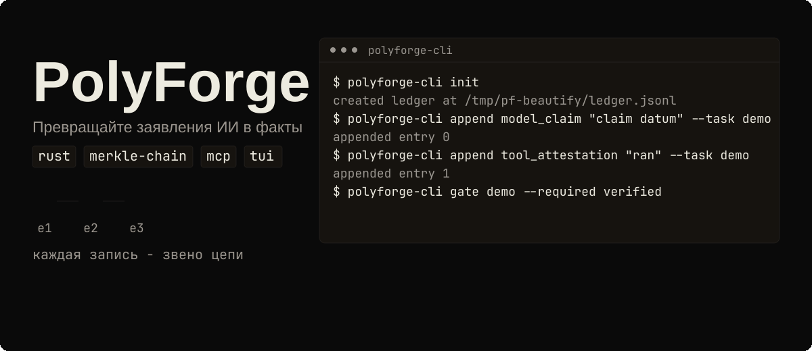
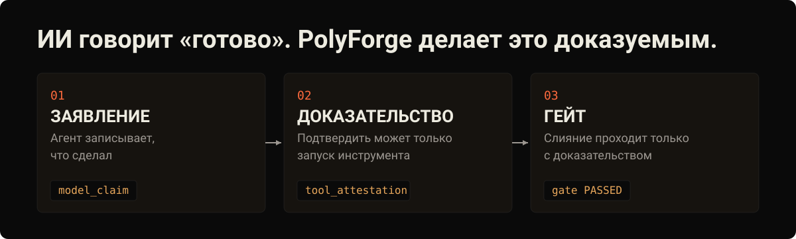

[English](README.md) | **Русский** | [Deutsch](README.de.md) | [中文](README.zh-CN.md)

# PolyForge

[](LICENSE)
[](https://github.com/tensorov/polyforge/actions)
[](https://www.rust-lang.org)
[](https://crates.io/crates/polyforge-core)
[](https://crates.io/crates/polyforge-toolrunner)
[](https://crates.io/crates/polyforge-mcp)
[](https://crates.io/crates/polyforge-cli)
[](https://crates.io/crates/polyforge-tui)

<p align="center"></p>
<p align="center"><sub>Анимированная демонстрация. Предпочитаете статичное изображение? Откройте <a href="assets/readme/hero.ru.svg">assets/readme/hero.ru.svg</a>.</sub></p>

## ИИ говорит «готово». PolyForge делает это доказуемым.

<p align="center"></p>

## Что такое PolyForge?

ИИ-агенты для написания кода работают быстро и сами отчитываются о результатах. PolyForge добавляет в ваш репозиторий журнал доказательств, который не может незаметно переписать историю. Агент записывает то, что заявляет о проделанной работе. Реальный запуск инструмента, например тесты, проверка типов или сборка, должен подтвердить каждое заявление, прежде чем оно будет считаться проверенным. Когда доказательства нет, гейт остаётся красным и работа не мержится.

Под капотом этот журнал представляет собой append-only Merkle-цепь: каждая запись фиксирует хеш предыдущей, поэтому правка одного байта ломает цепь, и все последующие проверки проваливаются.

## Доказательство

Всё описанное здесь покрыто 303 тестами по пяти крейтам воркспейса, плюс smoke-проверки CLI/MCP и end-to-end харнессы. Запустите набор сами: `cargo build --workspace && cargo test --workspace`.

Ещё три причины доверять этим числам:

- Этот репозиторий гейтит собственный CI через [tensorov/polyforge-action@v1](https://github.com/tensorov/polyforge-action) на каждый push и pull request.
- Гейт-бандлы воспроизводимы: второй успешный запуск даёт байт-в-байт идентичный бандл и тот же SHA-256.
- Исполняемый end-to-end разбор жизненного цикла доказательств поставляется в [crates/polyforge-core/examples/ledger_flow.rs](crates/polyforge-core/examples/ledger_flow.rs): `cargo run -p polyforge-core --example ledger_flow`.

## Установка и первый запуск

Установка из [crates.io](https://crates.io). Все пять крейтов опубликованы на версии v0.3.0; `polyforge-tui` выходит вместе с этим релизом. Нужен тулчейн Rust (1.85 или новее, 1.88+ для TUI):

```sh
cargo install polyforge-cli polyforge-mcp polyforge-tui
```

Запишите заявление, докажите его аттестацией инструмента, провалидируйте и пройдите два гейта:

```sh
export PF_LEDGER=/tmp/pf-demo/ledger.jsonl
export PF_EVIDENCE_DIR=/tmp/pf-demo/evidence/
polyforge-cli init
polyforge-cli append model_claim "claim datum" --task demo --commit abc123 --diff d1
polyforge-cli append tool_attestation "ran" --task demo
polyforge-cli ledger tail
polyforge-cli gate demo --required verified
polyforge-cli append validation "operator check" --task demo
polyforge-cli gate demo --required validated
```

Что произошло: `init` создал журнал, model claim создал запись `ModelClaimed`, аттестация инструмента повысила её до `Verified`, валидация повысила её дальше до `Validated`, и оба гейта прошли с кодом выхода 0. `ledger tail` напечатал 64-значный шестнадцатеричный хвостовой хеш SHA-256 цепи.


## Как это работает

У доказательства три состояния, и оно движется только вперёд:


- `model_claim`: модель записывает заявление о собственной работе. Создаёт запись `ModelClaimed`.
- `tool_attestation`: запуск инструмента из белого списка повышает заявление задачи до `Verified`.
- `eval_attestation`: оператор записывает результат оценки (эксперимент, запуск, отпечаток модели, бюджет), который также повышает заявление до `Verified`.
- `discrepancy`: оператор либо toolrunner при неудачном прогоне верификатора записывает след опровержения, который переводит заявление в `Refuted`.
- `validation`: валидация оператора повышает запись `Verified` до `Validated`.

Гейт может требовать `verified`, `validated` или оба сразу. Записи `Refuted` фиксируются, но никогда не удовлетворяют гейт. Аттестации инструментов несут метку реального времени, а когда верификатор запускается внутри git checkout, записанная полезная нагрузка отражает состояние репозитория (commit и diff), а не голую строку команды.

## Никогда не доверяй, всегда проверяй

- Одного слова модели недостаточно никогда. `model_claim` способен лишь создать новую запись `ModelClaimed`, и ничего больше.
- Чтобы достичь `Verified`, нужна аттестация от инструмента из белого списка: `cargo`, `rustc` и `gcc` для Rust и C; `pytest`, `ruff`, `mypy` и `pyright` для Python; `vitest`, `tsc`, `eslint` и `biome` для JavaScript и TypeScript.
- Через MCP замок ещё жёстче: инструмент `evidence_append` принимает только `kind=ModelClaim`. Аттестации, валидации и расхождения отклоняются на сервере, поэтому подключённая модель вообще не может создать записи `Verified`, `Refuted` или `Validated`.

## Гейтите в CI

Опубликованный action гейтит задачу против журнала и проверяет закоммиченный якорь Merkle-цепи. Этот репозиторий запускает его на каждый push и pull request.

```yaml
- uses: tensorov/polyforge-action@v1
  with:
    task-id: my-task
    required: verified,validated
    ledger-path: .pf/ledger.jsonl
    evidence-dir: .pf/evidence/
```

| Вход           | Обязателен | По умолчанию         | Описание                                                     |
| -------------- | ---------- | -------------------- | ------------------------------------------------------------ |
| `task-id`      | да         |                      | Id задачи для гейта против журнала.                          |
| `required`     | нет        | `verified,validated` | Разделённый запятыми список требуемых состояний доказательств. |
| `ledger-path`  | нет        | `.pf/ledger.jsonl`   | Путь к журналу относительно корня воркспейса.                |
| `evidence-dir` | нет        | `.pf/evidence/`      | Каталог доказательств относительно корня воркспейса.         |

Action работает по принципу fail-closed: повреждённая цепь, отсутствующий якорь или гейт, который так и не достиг требуемого состояния, проваливают job. Добавьте job как обязательную статус-проверку в ruleset ветки, и PR не сможет мержиться, пока гейт красный.

Успешный гейт пишет `gate-<task_id>.jsonl` плюс `gate-<task_id>.manifest.json` с содержимым `task_id`, `tail_hash`, `passed`, `bundle_sha256` и `tool_versions`. Неудачный гейт завершается ненулевым кодом и не пишет бандл. По умолчанию гейт оценивает последнее заявление задачи; передайте `--commit <sha> --diff <hash>`, чтобы закрепить его за конкретным заявлением, причём закреплённый гейт, который больше не совпадает с последним заявлением, отклоняется как устаревший вместо тихого прохождения по старым доказательствам. Запуск чужого репозитория в CI: добавьте шаг с Rust-тулчейном (например `dtolnay/rust-toolchain`) перед action, который выполняет `cargo install polyforge-cli --locked`.

## Подключите своих агентов

Каждый агент регистрирует один и тот же сервер `polyforge-mcp` поверх stdio. Убедитесь, что `polyforge-mcp` доступен в `PATH`, или укажите `command` на полный путь к вашему собранному бинарнику.

### OpenCode

В `opencode.json` (корень проекта или `~/.config/opencode/`):

```json
{
  "mcp": {
    "polyforge": {
      "type": "local",
      "command": ["polyforge-mcp"],
      "env": {
        "PF_MCP_TRANSPORT": "stdio"
      }
    }
  }
}
```

### Claude Code

```sh
claude mcp add polyforge -- polyforge-mcp
```

### Codex

В `~/.codex/config.toml`:

```toml
[mcp_servers.polyforge]
command = "polyforge-mcp"
env = { PF_MCP_TRANSPORT = "stdio" }
```

### OpenClaw

В `~/.openclaw/config.json` (пример, скорректируйте путь):

```json
{
  "mcpServers": {
    "polyforge": {
      "command": "polyforge-mcp",
      "args": [],
      "env": {
        "PF_MCP_TRANSPORT": "stdio"
      }
    }
  }
}
```

Сервер открывает четыре инструмента: `evidence_append` (принимает только `ModelClaim`, поэтому модели никогда не смогут добавить аттестацию или валидацию), `evidence_verify` (запускает инструмент из белого списка для проверки заявления; произвольные бинарники никогда не исполняются) и read-only пару `gate_evaluate` и `gate_report`.

Варианты транспорта: `PF_MCP_TRANSPORT=stdio` (по умолчанию) или `tcp` с `PF_MCP_ADDR` (по умолчанию `127.0.0.1:18888`). TCP-слушатель привязан только к loopback и требует `PF_MCP_TOKEN`; каждый запрос обязан передавать его как `_pf_token`, а отсутствие или неверный токен отклоняется JSON-RPC ошибкой `-32001`. `PF_MCP_LEDGER` задаёт путь к журналу (по умолчанию `.pf/ledger.jsonl`).

## Консоль оператора

LazyForge это терминальный UI для просмотра задач, валидации записей и массовой валидации по журналу доказательств. Установите командой `cargo install polyforge-tui` (бинарник: `lazyforge`) и прочитайте [руководство пользователя LazyForge](docs/lazyforge.md). Проверенные руководства по интеграции для OpenCode, Claude Code и Codex лежат в [docs/integrations/](docs/integrations/), а комплект подачи в каталог MCP servers находится в [docs/mcp-servers-pr-kit/](docs/mcp-servers-pr-kit/).

<details>
<summary><b>Архитектура: пять крейтов</b></summary>

Воркспейс из пяти крейтов (edition 2021, rust-version 1.85, разработка ведётся на тулчейне 1.95.0):

| Крейт                  | Ответственность                                                                                                          |
| ---------------------- | ------------------------------------------------------------------------------------------------------------------------ |
| `polyforge-core`       | Модель доказательств: записи с тремя состояниями, правила повышения, append-only Merkle-журнал и детерминированная оценка гейта. |
| `polyforge-toolrunner` | Раннер инструментов из белого списка: только разрешённые бинарники, типизированные аргументы, без shell, отпечаток окружения на каждую команду. |
| `polyforge-mcp`        | Сервер Model Context Protocol (rmcp): интерфейс, которым модели пользуются, чтобы добавлять заявления и опрашивать гейты.   |
| `polyforge-cli`        | Операторский CLI: init, append, инспекция журнала и исполнение гейтов над локальным журналом.                               |
| `polyforge-tui`        | Терминальная операторская консоль LazyForge: просмотр задач, валидация, массовая валидация по журналу доказательств.        |

Бинарник CLI называется `polyforge-cli` (это имя крейта); сделайте `alias pf=polyforge-cli`, если предпочитаете короткое имя.

Отпечатки окружения считаются на уровне команды: дайджест store-пути Nix и sha256 файла `devbox.lock` подмешиваются при наличии, sha256 `Cargo.lock` всегда, плюс значения ключевых переменных сборки вроде `CFLAGS`/`CXXFLAGS`/`LDFLAGS`/`RUSTDOCFLAGS`, когда они заданы. Для Python и JS/TS репозиториев раннер подмешивает `uv.lock`, `pnpm-lock.yaml`, `package-lock.json` и `yarn.lock` при наличии, обнаруживая их от корня git или предков cwd, поэтому `Cargo.toml` не требуется.

Мутирующие или загружающие код флаги запрещены на этапе валидации: `--fix` / `--unsafe-fixes` (ruff check), `--fix` / `--rulesdir` / `--resolve-plugins-relative-to` и небиблиотечные значения `--format` (eslint), `--apply` / `--apply-unsafe` / `--write` (biome check), `-u` / `--update` (vitest run), `-p` (кроме `-p no:*`) и `--pdb` (pytest). `gcc -v` не принимает дополнительных аргументов. Пакетные раннеры (`uv run`, `npx`, `npm exec`) исключены полностью, потому что их argv резолвит неограниченное множество бинарников. Инструменты резолвятся из PATH процесса polyforge; активация venv вашего проекта перед запуском аттестаций остаётся обязанностью оператора.

Прочая поверхность CLI: `ledger summary` печатает счётчики состояний по задачам одной строкой, удобной для grep (`tasks_verified=… tasks_validated=… tasks_failed=…`); `coverage-check --report <llvm-cov.json>` оценивает отчёт `cargo llvm-cov --json` против нижней границы покрытия (по умолчанию 80% суммарно / 80% на файл); любой вид `append` принимает необязательные record-only флаги идентичности `--experiment`, `--model`, `--run`, `--budget` и `--metadata`, которые переносятся сквозь повышение. Переменные окружения: `PF_LEDGER` (путь к журналу, по умолчанию `.pf/ledger.jsonl`), `PF_EVIDENCE_DIR` (каталог гейт-бандлов, по умолчанию `.pf/evidence/`), `PF_ENV_FINGERPRINT` (заданный оператором отпечаток, записываемый в аттестациях, по умолчанию `cli`).

Сборка из исходников:

```sh
cargo build --release   # binary lands in target/release/polyforge-cli
cargo build --workspace && cargo test --workspace
```

</details>

<details>
<summary><b>Гарантия защиты от подделки и перемотки</b></summary>

Журнал это append-only Merkle-цепь: каждая запись фиксирует хеш предыдущей. Перемотка файла назад или порча **одного байта** любой записи ломают цепь, и любой последующий `polyforge-cli gate` или `evidence_verify` падает с `LedgerIntegrity`. Проваленная проверка целостности никогда не фабрикует бандл или манифест: сбой показывается наружу, и ничего не записывается. Это проверено end-to-end харнессом (перевёрнутый байт в хвостовой записи означает, что гейт завершается ненулевым кодом с сообщением `ledger integrity broken at seq …`, без бандла, без манифеста).

Цепь защищена от переупорядочивания и конкурентных писателей: записи используют каноническую кодировку с префиксом длины (версия хеша 2), а закоммиченный sidecar-якорь фиксирует хвост цепи, так что перемотка за якорь обнаруживается. Писатели берут эксклюзивную файловую блокировку (`fs2`) вокруг каждого добавления, поэтому конкурентные процессы не могут перемешать записи.

Замечание о границах: защита от подделки действует внутри доверенного checkout. Цепь доказывает, что журнал не был переписан, но не то, что сам checkout аутентичен. Криптографическое внешнее заякоривание присутствует в roadmap (Phase 3).

</details>

<details>
<summary><b>Сравнительная матрица (обзор датирован 2026-08-09)</b></summary>

PolyForge это журнал доказательств единого формата: одна append-only Merkle-цепь, одна модель записей с тремя состояниями, один детерминированный гейт. Матрица ниже обозревает найденные на 2026-08-09 прямые инструменты классов evidence ledger и MCP, плюс три смежные категории для контекста. Среди обследованных прямых evidence-ledger инструментов PolyForge оказался единственным наблюдаемым воркспейсом из Rust-крейтов; остальные одноязычные или проприетарные. Факты взяты с публичных страниц каждого проекта; там, где источник молчит, в ячейке стоит `?`.

| Возможность | PolyForge | agent-gate | AttestMCP | AGA MCP | audit-ledger-mcp | Xiid | Zyvra | Omega | Observability | Provenance | Sandboxes |
| ----------- | --------- | ---------- | --------- | ------- | ---------------- | ---- | ----- | ----- | ------------- | ---------- | --------- |
| Журнал, защищённый от подделки | ✅ | ✅ | ✅ | ✅ | ✅ | ? | ? | ? | ? | ? | ? |
| Детерминированный гейт | ✅ | ✅ | ? | ✅ | ? | ? | ? | ? | ? | ? | ? |
| Интерфейс MCP | ✅ | ? | ✅ | ✅ | ✅ | ? | ? | ? | ? | ? | ? |
| CLI | ✅ | ? | ? | ? | ? | ? | ? | ? | ? | ? | ? |
| Открытый код | ✅ | ✅ | ✅ | ✅ | ✅ | ❌ | ? | ? | ? | ? | ? |
| Rust | ✅ | ❌ | ❌ | ❌ | ? | ? | ? | ? | ? | ? | ? |
| Модель доказательств с тремя состояниями | ✅ | ? | ? | ? | ? | ? | ? | ? | ? | ? | ? |
| Fail-closed при нарушении целостности | ✅ | ✅ | ? | ? | ? | ? | ? | ? | ? | ? | ? |
| Бандл доказательств на выходе | ✅ | ? | ? | ? | ? | ? | ? | ? | ? | ? | ? |
| Аппаратная аттестация | ❌ | ? | ? | ? | ? | ? | ? | ✅ | ? | ? | ? |
| SaaS / хостинг | ❌ | ? | ? | ? | ? | ? | ✅ | ? | ? | ? | ? |

Легенда: ✅ = возможность подтверждена цитируемым источником · ❌ = источник явно утверждает, что возможность отсутствует · `?` = источник молчит (неизвестно).

Источники (доступ выполнен 2026-08-09):

1. `agent-gate` — Jott2121/agent-gate — https://github.com/Jott2121/agent-gate
2. `AttestMCP` — attestmcp/attestmcp — https://github.com/attestmcp/attestmcp
3. `AGA MCP` — attestedintelligence/aga-mcp-server — https://github.com/attestedintelligence/aga-mcp-server
4. `audit-ledger-mcp` — shahidh68/audit-ledger-mcp — https://github.com/shahidh68/audit-ledger-mcp
5. `Xiid` — https://xiid.com
6. `Zyvra` — https://zyvra.tech
7. `Omega` — arXiv 2512.05951 — https://arxiv.org/abs/2512.05951
8. `Observability` — LangSmith / Langfuse / AgentOps / Arize Phoenix / Helicone — https://docs.smith.langchain.com, https://helicone.ai
9. `Provenance` — in-toto / Sigstore/cosign / Witness / SLSA — https://in-toto.io
10. `Sandboxes` — e2b / Modal / Daytona — https://e2b.dev

Итого: среди обследованных на 2026-08-09 прямых evidence-ledger инструментов PolyForge единственный воркспейс из Rust-крейтов, объединяющий Merkle-журнал единого формата, детерминированный гейт и интерфейс MCP в одном воркспейсе.

</details>

<details>
<summary><b>Производительность</b></summary>

Измерено на машине разработки релизным бинарником со свежим журналом в `/tmp/pf-bench`; пересобранный бинарник байт-в-байт идентичен измеренному:

| Сценарий | Значение | Как воспроизвести |
| -------- | -------- | ----------------- |
| Полная цепь из 100 задач (300 добавлений в журнал) | 0.510 s | `time ( for i in $(seq 1 100); do polyforge-cli append model_claim "bench claim $i" --task task$i --commit c$i --diff d$i >/dev/null; polyforge-cli append tool_attestation "ran" --task task$i >/dev/null; polyforge-cli append validation "op" --task task$i >/dev/null; done )` |
| 100 проверок гейта по журналу из 300 записей | 0.500 s | `time ( for i in $(seq 1 100); do polyforge-cli gate task$i --required validated >/dev/null; done )` |
| Размер релизного бинарника | 774664 B | `stat -c%s target/release/polyforge-cli` |
| Полная чистая пересборка (`cargo clean` + `cargo build --release`) | 34.15 s | `cargo clean && time cargo build --release` |

</details>

<details>
<summary><b>План развития</b></summary>

Путь к готовности к production, полные детали в [docs/ROADMAP.md](docs/ROADMAP.md). Приоритеты подчинены двум ограничениям: аттестации должны быть негеймабельными и воспроизводимыми (доверие прежде всего), и PolyForge гейтит собственную разработку (dogfooding).

| Фаза | Статус | Ключевые пункты |
| ---- | ------ | --------------- |
| Phase 0: Укрепление доверия + self-gating | **Выпущена** | Мутационное тестирование (`cargo-mutants`, Stryker), отпечатки Nix/Devbox, self-gating `polyforge-action` на этом репозитории |
| Phase 1: Внедрение | **Выпущена** | [`tensorov/polyforge-action`](https://github.com/tensorov/polyforge-action) v1 опубликована, Python/TS toolrunner, LazyForge TUI. Промпты Cline/Aider/Cursor намеренно вырезаны. |
| Phase 2: Масштабирование и наблюдаемость | **Начата** | Подкоманда экспортёра OpenTelemetry/OTLP уже существует. Далее: удалённый бэкенд (PostgreSQL + S3/DynamoDB), веб-дашборд + REST/gRPC API, middleware LangGraph/CrewAI/AutoGen |
| Phase 3: Enterprise и экосистема | Будущее | SLSA/in-toto/Sigstore, глубокие плагины (Cursor/Windsurf/Continue.dev), human-in-the-loop в вебе, Policy-as-Code |
| Backlog амбициозных идей | Будущее | Маркетплейс верификации, TEE / аппаратные аттестации |

</details>

## Лицензия

PolyForge лицензируется по [Apache License, Version 2.0](LICENSE). Требования к указанию авторства смотрите в файле [NOTICE](NOTICE).

## Участие в разработке

Перед открытием issue прочитайте [SECURITY.md](SECURITY.md), чтобы узнать, как сообщать об уязвимостях. Сообщения о новых возможностях и багах используют шаблоны из [.github/ISSUE_TEMPLATE/](.github/ISSUE_TEMPLATE/).
