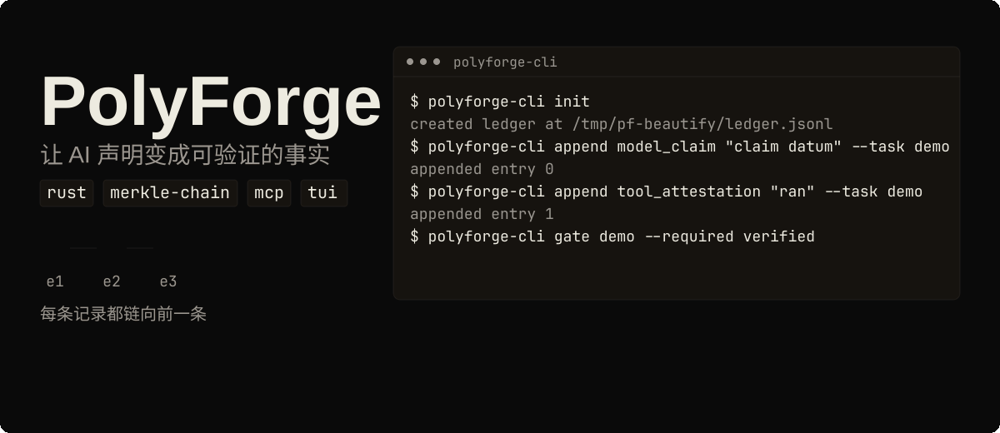
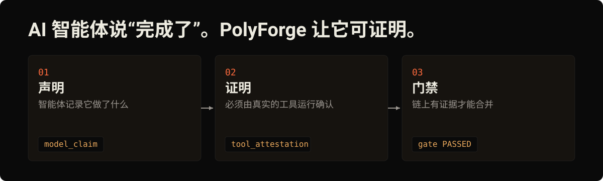

[English](README.md) | [Русский](README.ru.md) | [Deutsch](README.de.md) | **中文**

# PolyForge

[](LICENSE)
[](https://github.com/tensorov/polyforge/actions)
[](https://www.rust-lang.org)
[](https://crates.io/crates/polyforge-core)
[](https://crates.io/crates/polyforge-toolrunner)
[](https://crates.io/crates/polyforge-mcp)
[](https://crates.io/crates/polyforge-cli)
[](https://crates.io/crates/polyforge-tui)

<p align="center"></p>
<p align="center"><sub>动画演示。偏好静态图片？请打开 <a href="assets/readme/hero.zh.svg">assets/readme/hero.zh.svg</a>。</sub></p>

## AI 智能体说"完成了"。PolyForge 让它可证明。

<p align="center"></p>

## PolyForge 是什么？

AI 编码智能体工作迅速，并自行汇报结果。PolyForge 为你的仓库添加一本无法悄悄改写历史的笔记本。智能体写下它声称完成的工作。一次真实的工具运行，例如测试、类型检查或构建，必须确认每条声明，它才能算作已验证。当证据缺失时，门禁保持红色，工作无法合并。

在底层，这本笔记本是一条只追加的 Merkle 链：每一条目都提交到前一条目的哈希，因此改动单个字节就会破坏整条链，之后的所有检查都会失败。

## 证明

本文描述的一切都由五个 workspace crate 中的 303 个测试覆盖，外加 CLI/MCP 冒烟测试和端到端测试套件。请亲自运行：`cargo build --workspace && cargo test --workspace`。

还有三个相信这些数字的理由：

- 本仓库在每次 push 和 pull request 时都用 [tensorov/polyforge-action@v1](https://github.com/tensorov/polyforge-action) 为自己的 CI 设置门禁。
- 门禁包是可复现的：第二次通过的运行会产生字节完全相同的包和相同的 SHA-256。
- 一个可运行的证据生命周期端到端演示随附于 [crates/polyforge-core/examples/ledger_flow.rs](crates/polyforge-core/examples/ledger_flow.rs)：`cargo run -p polyforge-core --example ledger_flow`。

## 安装与首次运行

从 [crates.io](https://crates.io) 安装。全部五个 crate 均以 v0.3.0 发布；`polyforge-tui` 随本次发布一同推出。你需要一个 Rust 工具链（1.85 或更新版本，TUI 需要 1.88+）：

```sh
cargo install polyforge-cli polyforge-mcp polyforge-tui
```

记录一条声明，用工具证明记录证实它，验证它，然后通过两道门禁：

```sh
export PF_LEDGER=/tmp/pf-demo/ledger.jsonl
export PF_EVIDENCE_DIR=/tmp/pf-demo/evidence/
polyforge-cli init
polyforge-cli append model_claim "claim datum" --task demo --commit abc123 --diff d1
polyforge-cli append tool_attestation "ran" --task demo
polyforge-cli ledger tail
polyforge-cli gate demo --required verified
polyforge-cli append validation "operator check" --task demo
polyforge-cli gate demo --required validated
```

发生了什么：`init` 创建了账本，模型声明创建了 `ModelClaimed` 条目，工具证明记录将其提升为 `Verified`，验证进一步将其提升为 `Validated`，两道门禁都以退出码 0 通过。`ledger tail` 打印了链尾的 64 位十六进制 SHA-256 尾部哈希。


## 工作原理

证据是三态的，且只会向前推进：


- `model_claim`：模型记录关于其自身工作的声明。创建 `ModelClaimed` 条目。
- `tool_attestation`：一次白名单内工具的运行将任务的声明提升为 `Verified`。
- `eval_attestation`：操作员记录一次评估结果（实验、运行、模型指纹、预算），同样将声明提升为 `Verified`。
- `discrepancy`：操作员，或验证器运行失败时的 toolrunner，记录一条反驳轨迹，将声明移至 `Refuted`。
- `validation`：操作员验证将 `Verified` 条目提升为 `Validated`。

门禁可以要求 `verified`、`validated` 或两者兼有。`Refuted` 条目会被记录但永远无法满足门禁。工具证明记录带有墙钟时间戳；当验证器在 git checkout 内运行时，记录的载荷反映的是仓库状态（commit 和 diff），而不是裸命令字符串。

## 永不轻信，始终验证

- 仅凭模型的口头保证永远不够。`model_claim` 只能创建新的 `ModelClaimed` 条目，仅此而已。
- 达到 `Verified` 需要来自白名单内工具的证明记录：Rust 和 C 用 `cargo`、`rustc` 和 `gcc`；Python 用 `pytest`、`ruff`、`mypy` 和 `pyright`；JavaScript 和 TypeScript 用 `vitest`、`tsc`、`eslint` 和 `biome`。
- 通过 MCP 锁得更紧：`evidence_append` 工具只接受 `kind=ModelClaim`。证明记录、验证和差异记录都会在服务器端被拒绝，因此连接的模型根本无法创建 `Verified`、`Refuted` 或 `Validated` 条目。

## 在 CI 中设置门禁

已发布的 action 会针对账本对任务进行门禁检查，并验证已提交的 Merkle 链锚点。本仓库在每次 push 和 pull request 时都会运行它。

```yaml
- uses: tensorov/polyforge-action@v1
  with:
    task-id: my-task
    required: verified,validated
    ledger-path: .pf/ledger.jsonl
    evidence-dir: .pf/evidence/
```

| 输入           | 必填 | 默认值               | 描述                                                 |
| -------------- | ---- | -------------------- | ---------------------------------------------------- |
| `task-id`      | 是   |                      | 用于对照账本进行门禁的任务 ID。                       |
| `required`     | 否   | `verified,validated` | 所需证据状态的逗号列表。                             |
| `ledger-path`  | 否   | `.pf/ledger.jsonl`   | 相对于 workspace 根目录的账本路径。                   |
| `evidence-dir` | 否   | `.pf/evidence/`      | 相对于 workspace 根目录的证据目录。                   |

该 action 采用失败关闭策略：链损坏、锚点缺失或门禁从未达到所需状态都会使 job 失败。将该 job 设为分支规则集中的必需状态检查后，只要门禁是红色，PR 就无法合并。

通过的门禁会写入 `gate-<task_id>.jsonl` 以及包含 `task_id`、`tail_hash`、`passed`、`bundle_sha256` 和 `tool_versions` 的 `gate-<task_id>.manifest.json`。失败的门禁以非零码退出且不写入任何包。默认情况下，门禁评估任务的最新声明；传入 `--commit <sha> --diff <hash>` 可将其固定到特定声明，固定的门禁若不再匹配最新声明会被判定为过期而拒绝，而不是静默地针对旧证据通过。在 CI 中运行外部仓库时：在该 action 之前添加一个 Rust 工具链步骤（例如 `dtolnay/rust-toolchain`），它会执行 `cargo install polyforge-cli --locked`。

## 连接你的智能体

每个智能体都通过 stdio 注册同一个 `polyforge-mcp` 服务器。确保 `polyforge-mcp` 位于 `PATH` 中，或者将 `command` 指向你构建的二进制的完整路径。

### OpenCode

在 `opencode.json`（项目根目录或 `~/.config/opencode/`）中：

```json
{
  "mcp": {
    "polyforge": {
      "type": "local",
      "command": ["polyforge-mcp"],
      "env": {
        "PF_MCP_TRANSPORT": "stdio"
      }
    }
  }
}
```

### Claude Code

```sh
claude mcp add polyforge -- polyforge-mcp
```

### Codex

在 `~/.codex/config.toml` 中：

```toml
[mcp_servers.polyforge]
command = "polyforge-mcp"
env = { PF_MCP_TRANSPORT = "stdio" }
```

### OpenClaw

在 `~/.openclaw/config.json`（示例，请调整路径）中：

```json
{
  "mcpServers": {
    "polyforge": {
      "command": "polyforge-mcp",
      "args": [],
      "env": {
        "PF_MCP_TRANSPORT": "stdio"
      }
    }
  }
}
```

服务器暴露四个工具：`evidence_append`（只接受 `ModelClaim`，因此模型永远无法追加证明记录或验证）、`evidence_verify`（运行白名单内的工具来验证声明；绝不执行任意二进制文件），以及只读的 `gate_evaluate` 和 `gate_report`。

传输选项：`PF_MCP_TRANSPORT=stdio`（默认）或 `tcp` 配合 `PF_MCP_ADDR`（默认 `127.0.0.1:18888`）。TCP 监听器仅绑定环回地址且要求 `PF_MCP_TOKEN`；每个请求必须携带 `_pf_token`，缺失或无效的令牌会以 JSON-RPC 错误 `-32001` 拒绝。`PF_MCP_LEDGER` 选择账本路径（默认 `.pf/ledger.jsonl`）。

## 操作员控制台

LazyForge 是一个终端 UI，用于浏览任务、验证条目以及在证据账本上批量验证。使用 `cargo install polyforge-tui` 安装（二进制名：`lazyforge`），并阅读 [LazyForge 用户指南](docs/lazyforge.md)。OpenCode、Claude Code 和 Codex 的已验证集成指南位于 [docs/integrations/](docs/integrations/)，MCP servers 目录提交套件位于 [docs/mcp-servers-pr-kit/](docs/mcp-servers-pr-kit/)。

<details>
<summary><b>架构：五个 crate</b></summary>

由五个 crate 组成的 workspace（edition 2021，rust-version 1.85，基于 toolchain 1.95.0 开发）：

| Crate                  | 职责                                                                                                                     |
| ---------------------- | ------------------------------------------------------------------------------------------------------------------------ |
| `polyforge-core`       | 证据模型：三态条目、提升规则、只追加的 Merkle 账本以及确定性门禁评估。                                                      |
| `polyforge-toolrunner` | 白名单工具运行器：仅限白名单内的二进制文件、类型化参数、无 shell、按命令计算的环境指纹。                                    |
| `polyforge-mcp`        | Model Context Protocol 服务器（rmcp）：模型用于追加声明和查询门禁的接口。                                                   |
| `polyforge-cli`        | 操作员 CLI：init、append、账本检查以及本地账本上的门禁执行。                                                                |
| `polyforge-tui`        | LazyForge 终端操作员控制台：浏览任务、验证、在证据账本上批量验证。                                                          |

CLI 二进制名为 `polyforge-cli`（即 crate 名）；如果你喜欢短名称，可以 `alias pf=polyforge-cli`。

环境指纹按命令计算：存在时纳入 Nix store 路径摘要和 `devbox.lock` sha256，始终纳入 `Cargo.lock` sha256，并在设置了关键构建环境变量（如 `CFLAGS`/`CXXFLAGS`/`LDFLAGS`/`RUSTDOCFLAGS`）时纳入其值。对于 Python 和 JS/TS 仓库，运行器会在存在时纳入 `uv.lock`、`pnpm-lock.yaml`、`package-lock.json` 和 `yarn.lock`，从 git 根目录或 cwd 祖先目录中发现它们，因此不需要 `Cargo.toml`。

具有修改性或会加载代码的标志在校验时被拒绝：`--fix` / `--unsafe-fixes`（ruff check）、`--fix` / `--rulesdir` / `--resolve-plugins-relative-to` 及非内置 `--format` 值（eslint）、`--apply` / `--apply-unsafe` / `--write`（biome check）、`-u` / `--update`（vitest run）、`-p`（`-p no:*` 除外）和 `--pdb`（pytest）。`gcc -v` 不接受任何额外参数。包运行器（`uv run`、`npx`、`npm exec`）被完全排除，因为它们的 argv 会解析出无界的二进制集合。工具从 polyforge 进程的 PATH 解析；在运行证明记录之前激活项目的 venv 是操作员的职责。

其他 CLI 表面：`ledger summary` 以一行可 grep 的文本打印每个任务的状态计数（`tasks_verified=… tasks_validated=… tasks_failed=…`）；`coverage-check --report <llvm-cov.json>` 对照覆盖率下限（默认聚合 80% / 单文件 80%）评估 `cargo llvm-cov --json` 报告；任何 `append` 类型都接受可选的仅记录身份标志 `--experiment`、`--model`、`--run`、`--budget` 和 `--metadata`，并在提升时一并传递。环境变量：`PF_LEDGER`（账本路径，默认 `.pf/ledger.jsonl`）、`PF_EVIDENCE_DIR`（门禁包，默认 `.pf/evidence/`）、`PF_ENV_FINGERPRINT`（操作员提供的指纹，记录在证明记录上，默认 `cli`）。

从源码构建：

```sh
cargo build --release   # binary lands in target/release/polyforge-cli
cargo build --workspace && cargo test --workspace
```

</details>

<details>
<summary><b>防篡改与回滚保证</b></summary>

账本是一条只追加的 Merkle 链：每个条目都提交到前一个条目的哈希。回滚文件或篡改任何条目的**一个字节**都会破坏链条，之后的任何 `polyforge-cli gate` 或 `evidence_verify` 都会以 `LedgerIntegrity` 失败。完整性检查失败时绝不会伪造包或清单：失败会被如实呈现，什么都不会写入。测试套件对此进行了端到端演练（尾部条目的字节翻转意味着门禁以非零码退出并输出 `ledger integrity broken at seq …`，没有包，没有清单）。

链条针对重排序和并发写入者进行了加固：条目使用带长度前缀的规范编码（hash version 2），并且已提交的锚点 sidecar 记录链尾，因此越过锚点的回滚会被检测到。写入者在每次追加期间持有独占文件锁（`fs2`），因此并发进程无法交错写入条目。

范围说明：防篡改保证在受信任的 checkout 内有效。链证明的是账本未被重写，而不是 checkout 本身是真实的。密码学外部锚定已在路线图中（Phase 3）。

</details>

<details>
<summary><b>对比矩阵（调研日期 2026-08-09）</b></summary>

PolyForge 是单一格式的证据账本：一条只追加的 Merkle 链、一个三态条目模型、一道确定性门禁。下表调研了 2026-08-09 找到的直接同类的证据账本和 MCP 工具，外加三个相邻类别作为背景。在被调研的直接证据账本工具中，PolyForge 是唯一观察到的 Rust crate workspace；其余都是单语言或专有产品。事实来自各项目的公开页面；来源未提及之处单元格显示 `?`。

| 功能 | PolyForge | agent-gate | AttestMCP | AGA MCP | audit-ledger-mcp | Xiid | Zyvra | Omega | Observability | Provenance | Sandboxes |
| ---- | --------- | ---------- | --------- | ------- | ---------------- | ---- | ----- | ------ | ------------- | ---------- | --------- |
| 防篡改账本 | ✅ | ✅ | ✅ | ✅ | ✅ | ? | ? | ? | ? | ? | ? |
| 确定性门禁 | ✅ | ✅ | ? | ✅ | ? | ? | ? | ? | ? | ? | ? |
| MCP 接口 | ✅ | ? | ✅ | ✅ | ✅ | ? | ? | ? | ? | ? | ? |
| CLI | ✅ | ? | ? | ? | ? | ? | ? | ? | ? | ? | ? |
| 开源 | ✅ | ✅ | ✅ | ✅ | ✅ | ❌ | ? | ? | ? | ? | ? |
| Rust | ✅ | ❌ | ❌ | ❌ | ? | ? | ? | ? | ? | ? | ? |
| 三态证据模型 | ✅ | ? | ? | ? | ? | ? | ? | ? | ? | ? | ? |
| 完整性破坏时失败关闭 | ✅ | ✅ | ? | ? | ? | ? | ? | ? | ? | ? | ? |
| 证据包输出 | ✅ | ? | ? | ? | ? | ? | ? | ? | ? | ? | ? |
| 硬件证明记录 | ❌ | ? | ? | ? | ? | ? | ? | ✅ | ? | ? | ? |
| SaaS / 托管服务 | ❌ | ? | ? | ? | ? | ? | ✅ | ? | ? | ? | ? |

图例：✅ = 功能已被引用来源确认 · ❌ = 来源明确说明该功能不存在 · `?` = 来源未提及（未知）。

来源（访问日期 2026-08-09）：

1. `agent-gate` — Jott2121/agent-gate — https://github.com/Jott2121/agent-gate
2. `AttestMCP` — attestmcp/attestmcp — https://github.com/attestmcp/attestmcp
3. `AGA MCP` — attestedintelligence/aga-mcp-server — https://github.com/attestedintelligence/aga-mcp-server
4. `audit-ledger-mcp` — shahidh68/audit-ledger-mcp — https://github.com/shahidh68/audit-ledger-mcp
5. `Xiid` — https://xiid.com
6. `Zyvra` — https://zyvra.tech
7. `Omega` — arXiv 2512.05951 — https://arxiv.org/abs/2512.05951
8. `Observability` — LangSmith / Langfuse / AgentOps / Arize Phoenix / Helicone — https://docs.smith.langchain.com, https://helicone.ai
9. `Provenance` — in-toto / Sigstore/cosign / Witness / SLSA — https://in-toto.io
10. `Sandboxes` — e2b / Modal / Daytona — https://e2b.dev

综合来看：在 2026-08-09 调研的直接证据账本工具中，PolyForge 是唯一在同一个 workspace 中结合了单格式 Merkle 账本、确定性门禁和 MCP 接口的 Rust crate workspace。

</details>

<details>
<summary><b>性能</b></summary>

在开发机器上使用 release 二进制和 `/tmp/pf-bench` 中的全新账本测得；重新构建的二进制与测量所用二进制字节完全相同：

| 场景 | 数值 | 复现方式 |
| ---- | ----- | -------- |
| 100 任务完整链（300 次账本追加） | 0.510 s | `time ( for i in $(seq 1 100); do polyforge-cli append model_claim "bench claim $i" --task task$i --commit c$i --diff d$i >/dev/null; polyforge-cli append tool_attestation "ran" --task task$i >/dev/null; polyforge-cli append validation "op" --task task$i >/dev/null; done )` |
| 对 300 条目账本的 100 次门禁检查 | 0.500 s | `time ( for i in $(seq 1 100); do polyforge-cli gate task$i --required validated >/dev/null; done )` |
| Release 二进制大小 | 774664 B | `stat -c%s target/release/polyforge-cli` |
| 完全干净重建（`cargo clean` + `cargo build --release`） | 34.15 s | `cargo clean && time cargo build --release` |

</details>

<details>
<summary><b>路线图</b></summary>

生产就绪路径，完整细节见 [docs/ROADMAP.md](docs/ROADMAP.md)。优先级遵循两个约束：证明记录必须不可操纵且可复现（信任优先），以及 PolyForge 为自己的开发设置门禁（自我实践/dogfooding）。

| 阶段 | 状态 | 关键事项 |
| ---- | ------ | --------- |
| Phase 0：信任加固 + 自我门禁 | **已发布** | 变异测试（`cargo-mutants`、Stryker）、Nix/Devbox 指纹、本仓库上的 `polyforge-action` 自我门禁 |
| Phase 1：采用 | **已发布** | [`tensorov/polyforge-action`](https://github.com/tensorov/polyforge-action) v1 已发布、Python/TS 工具运行器、LazyForge TUI。有意砍掉了 Cline/Aider/Cursor 提示词。 |
| Phase 2：规模化与可观测性 | **已开始** | OpenTelemetry/OTLP 导出器子命令已存在。下一步：远程后端（PostgreSQL + S3/DynamoDB）、Web 仪表盘 + REST/gRPC API、LangGraph/CrewAI/AutoGen 中间件 |
| Phase 3：企业与生态 | 未来 | SLSA/in-toto/Sigstore、深度插件（Cursor/Windsurf/Continue.dev）、Web human-in-the-loop、Policy-as-Code |
| Moonshot 积压 | 未来 | 验证市场、TEE / 硬件证明记录 |

</details>

## 许可证

PolyForge 基于 [Apache License, Version 2.0](LICENSE) 许可发布。署名要求参见 [NOTICE](NOTICE) 文件。

## 参与贡献

在提交 issue 之前，请先阅读 [SECURITY.md](SECURITY.md) 了解如何报告漏洞。功能建议和缺陷报告请使用 [.github/ISSUE_TEMPLATE/](.github/ISSUE_TEMPLATE/) 下的模板。
